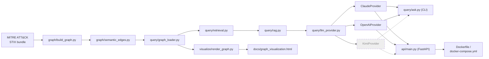

# CLAUDE.md

## Project

A knowledge-graph prototype over a subset of MITRE ATT&CK: 10-15
techniques across 2-3 threat groups, modeled as a NetworkX MultiDiGraph,
with hand-authored semantic edges (temporal/causal relationships between
techniques, not just "technique exists") and a small Graph RAG query
layer on top.

This is a scoped proof-of-concept, not a production platform. No live
CTI ingestion, no autonomous extraction pipeline, no multi-domain
expansion - all seed data and semantic edges are manually authored
against real, cited sources.

## Architecture

Hand-authored pipeline diagram (update by hand when the pipeline
changes - not touched by `graph/generate_diagrams.py`; see Diagrams
below for the full auto-generated-vs-hand-authored split):



- `graph/` - graph construction and all edge authoring: `build_graph.py`
  builds structural nodes/edges (Tactic, Technique, Sub-technique, Group,
  Software; HAS_TACTIC, USES_TECHNIQUE) from real STIX data via
  `mitreattack-python`. `semantic_edges.py` hand-authors the semantic
  edges (TEMPORALLY_PRECEDES, CAUSALLY_ENABLES) directly as Python data
  in `SEMANTIC_EDGES`, layered onto the structural graph - not JSON, and
  not routed through `ingestion/`.
- `ingestion/` - reserved for a future automated CTI ingestion pipeline.
  Empty in this prototype - no autonomous extraction pipeline is in
  scope here (see Project, above); all seed data and semantic edges are
  authored directly in `graph/` instead. The deferred design for what
  would eventually live here - a multi-agent continuous-ingestion
  approach - is written up, design-only and unbuilt, in
  `docs/future/multi-agent-ingestion.md`; see
  `.claude/skills/scale-to-continuous-ingestion/` for the explicit
  trigger condition before anyone acts on it.
- `query/` - Graph RAG: `graph_loader.py` loads the pre-built combined
  graph; `retrieval.py` traverses it for one technique's structural
  usage and directly-connected semantic edges (pure Python, no LLM);
  `llm_provider.py` defines the vendor-agnostic `LLMProvider` interface
  (`ClaudeProvider` and `OpenAIProvider` implemented, `KimiProvider`
  still stubbed - see "Adding an LLM Provider" below); `rag.py` sends the
  retrieved facts plus the question to whichever provider is configured,
  constrained by a system prompt to formatting only - LLM does not
  originate facts; `ask.py` is the CLI entry point
  (`python -m query.ask "..."`). See docs/decisions/003-query-layer-
  scope.md for why retrieval is scoped to one technique/one hop and
  entity extraction is plain regex, and docs/decisions/004-llm-provider-
  abstraction.md for the provider interface.
- `visualize/` - `render_graph.py` builds an interactive pyvis
  visualization from the same combined graph `query/graph_loader.py`
  loads (a separate consumer of it, not part of the query/RAG path) -
  nodes colored/shaped by type and sized by degree, a per-group filter
  that dims (not removes) everything not directly connected to the
  selected group, structural vs. semantic edge styling (semantic edge
  confidence drives line width/opacity), and hover tooltips carrying
  every semantic edge's real citation/confidence/sample_size. Regenerate
  with `python -m visualize.render_graph` whenever
  `data/graph_with_semantics.json` changes; writes
  `docs/graph_visualization.html`, a single self-contained file (vis-
  network inlined, no external JS fetch to draw the graph) linked near
  the top of README. Same idempotency guarantee as the `generate-
  diagrams` skill's Mermaid output (sorted traversal, no timestamps/
  random IDs, byte-identical on a rerun with unchanged data) - verified
  for real by running it twice and diffing - but this is a separate,
  unrelated generator: `graph/generate_diagrams.py` only touches Mermaid
  diagrams inside `GENERATED` markers in existing `.md` files, never
  this HTML file, and this script is never triggered by that skill.
- `api/` - `main.py`, a FastAPI wrapper around the same query layer
  `query/ask.py` (CLI) already calls - `POST /query` reuses
  `query/retrieval.py`, `query/rag.py`, and `query/llm_provider.py`
  directly (including `has_credentials()`'s facts-only degradation),
  plus `GET /health` (confirms the graph loaded, with real node/edge
  counts) and `GET /techniques` (the 13 seed technique IDs). A new
  entry point on top of existing logic, not a second implementation of
  it - see docs/decisions/007-api-and-containerization.md for why
  FastAPI and how request-size/error-handling basics are covered
  (`MaxBodySizeMiddleware`, a catch-all exception handler), and
  docs/security-assessment.md's matching dated entry for the LLM/code
  lens pass run against it before it was called done.
- `Dockerfile` / `docker-compose.yml` / `.dockerignore` - containerizes
  `api/`. Single-stage (`python:3.13-slim`; no dependency in
  `requirements.txt` needs build-stage tooling the runtime stage
  doesn't). `data/graph_with_semantics.json` is a committed, tracked
  file in this repo, so the image is just `COPY`'d it like any other
  source file - the container never fetches the 48MB raw STIX bundle or
  runs `graph/build_graph.py`/`graph/semantic_edges.py` at build time,
  and `.dockerignore` excludes `data/raw/`, `data/test_logs/`, and
  `.env` so neither the raw bundle nor a secret can end up in the image
  by accident. `docker-compose.yml` wraps the one service with a port
  mapping and an optional `.env` reference for the LLM provider key -
  see docs/decisions/007 for the full reasoning, including why this
  isn't a build-vs-mount tradeoff in the usual sense.
- `tests/` - `test_query_layer_against_evtx.py` is the project's first
  automated test: cross-checks real fetched atomic-evtx samples (see
  `.claude/skills/fetch-test-logs/`) against the graph, confirming a
  technique real telemetry says happened is one our graph actually has
  structural + semantic content for. Pure `query/retrieval.py` - no LLM
  call, deterministic, free. Skips (not fails) if
  `data/test_logs/` hasn't been fetched yet - see `pytest` under Current
  status. `test_adversarial_queries.py` calls the real query pipeline
  end-to-end (no mocking) with adversarial inputs - see
  `.claude/skills/red-team-assessment/`.
- `docs/attack-patterns/` - one case file per technique (problem,
  mechanics, how the graph models it, sources) - see
  `.claude/skills/attack-pattern-doc/SKILL.md`
- `docs/decisions/` - ADRs for real engineering decisions - see
  `.claude/skills/build-and-document/SKILL.md`
- `docs/security-assessment.md` - append-only, dated findings log across
  all three of the `red-team-assessment` skill's lenses (LLM, code,
  web/frontend - renamed and broadened 2026-08-15 from
  `ai-security-assessment`, LLM-only) - see
  `.claude/skills/red-team-assessment/SKILL.md`
- `NOTES-private.md` - gitignored, personal/product-vision notes only.
  Never referenced by anything that gets committed.

### Diagrams: auto-generated vs. hand-authored

Two categories, unambiguous by construction (see
`.claude/skills/generate-diagrams/SKILL.md` for the full contract):

- **Auto-generated** (never hand-edit - rerun `graph/generate_diagrams.py`
  instead; each lives inside `<!-- BEGIN GENERATED -->` /
  `<!-- END GENERATED -->` markers): the `## Flow` section in every
  `docs/attack-patterns/<ID>-*.md` case file, and the kill-chain diagram
  under README.md's "Technique Relationship Graph" section.
- **Hand-authored** (update manually when the architecture changes; no
  `GENERATED` markers, never touched by the script): the system
  architecture diagram above and in README.md's "Architecture" section,
  the query-flow sequence diagram in docs/decisions/003-query-layer-
  scope.md, and the provider-abstraction class diagram in
  docs/decisions/004-llm-provider-abstraction.md.

## Conventions

- Every semantic edge carries confidence score + sample_size + a real
  citation, or is explicitly labeled an estimate. No invented data.
- Structural data (nodes, HAS_TECHNIQUE/USES_TECHNIQUE edges) comes from
  the official `mitreattack-python` library - real, not synthetic.
- Semantic edges (Phase 2 schema) are hand-authored for the prototype,
  not auto-extracted. This is a deliberate scope decision - see
  docs/decisions/002-semantic-edge-schema.md.

## Code Review Standards

Patterns to apply going forward, not a list of past mistakes:

- Extract repeated lookup/extraction logic into a named helper function
  rather than inlining a generator expression or nested loop in the
  middle of graph-building code. A helper with a clear name documents
  intent at the call site and gives the logic one place to fix.
- Prefer an early-exit loop over `next(generator, default)` for "find
  the first match" logic - easier to read and to extend if the match
  condition ever needs to grow past a single comparison.
- Use `collections.Counter` for type-counting patterns instead of a
  manually maintained `dict` with `.get(key, 0) + 1`.
- Don't add complexity (custom JSON encoders, filtering/indexing layers,
  etc.) to solve a problem that hasn't actually occurred - verify first
  (e.g. does `json.dumps()` actually fail without a `default=`
  fallback?) before reaching for a more complex solution.
- Performance tradeoffs that are fine at the current scale (e.g. loading
  the full STIX bundle into memory on every run, appropriate for 13 seed
  techniques) should be left alone, with a one-line comment marking them
  as an accepted tradeoff and naming the condition that would make them
  worth revisiting - not solved preemptively.

## Model Usage

Convention for which Claude model tier to use on this project, going
forward - apply this without being re-asked. Match the tier to the task
below (via `/model` for the session, or the `model` param on a spawned
Agent/subagent for a single sub-task) rather than defaulting to one
model for everything.

- **Haiku 4.5** - mechanical, single-correct-answer tasks: running or
  re-running `graph/build_graph.py` / `graph/semantic_edges.py` and
  reading off the node/edge counts, environment/dependency
  troubleshooting (e.g. venv setup), formatting-only edits, and
  BUILD_LOG entries whose content has already been decided and just
  needs writing up. These have an immediately checkable outcome (the
  script runs or it doesn't; the count matches or it doesn't), so
  reasoning depth buys little - speed and cost efficiency matter more.
- **Sonnet 5** (default) - the bulk of the project: implementing graph/
  ingestion code, drafting attack-pattern case files and ADRs once the
  supporting sources are already in hand, general web research and
  citation gathering, routine edits and code review. Sustained
  engineering work that needs solid reasoning and code quality but isn't
  the highest-stakes judgment call in the pipeline.
- **Opus 5** - high-stakes reasoning where a subtle mistake becomes
  invented or silently-wrong data baked into the graph: assigning
  `confidence`/`sample_size` to a semantic edge, designing or revising
  the semantic-edge schema itself (ADR-level architecture decisions),
  and reconciling conflicting or ambiguous evidence across multiple CTI
  sources before committing to an edge's direction. This project's
  credibility rests entirely on "no invented data" (see Conventions
  below) - these are exactly the spots where a plausible-sounding but
  wrong inference is hardest to catch after the fact, as happened once
  already this project (see BUILD_LOG.md, 2026-08-13 entry on the
  reversed T1059.001/T1021.001 edge) - so the extra reasoning depth is
  worth the cost here specifically, not project-wide.

## Adding an LLM Provider

The query layer's LLM call is behind a vendor-agnostic interface
(`query/llm_provider.py`, see docs/decisions/004-llm-provider-
abstraction.md) specifically so a new provider is a five-minute addition,
not a rewrite. To add one:

1. Subclass `LLMProvider` and implement `generate(self, prompt, *,
   system=None) -> str`. Raise on failure - never return a placeholder
   or fabricated string.
2. Add one line to the `PROVIDERS` dict in `query/llm_provider.py`
   mapping a short name (e.g. `"openai"`) to the class.
3. That's it - `query/rag.py` and `query/ask.py` need no changes.
   Selecting the provider is a config change: set `LLM_PROVIDER=<name>`
   in `.env`, or pass `provider=YourProvider()` directly to
   `rag.answer()`.

`OpenAIProvider` is implemented for real (Responses API, model default
`gpt-5.1`, override via `OPENAI_MODEL`) now that an `OPENAI_API_KEY` is
configured. `KimiProvider` still exists as a stub (implements the
interface, `generate()` raises `NotImplementedError` naming exactly
what's missing) - wiring it up for real is steps 1-2 above once a key
exists, not new design work. Set `LLM_PROVIDER=openai` in `.env` to make
OpenAI the default instead of Claude.

## Current status

Phase: Query layer built (Phase 3 of README's scope), on top of the
Phase 1 structural graph and Phase 2 semantic edges.

- `data/raw/enterprise-attack.json` - official MITRE ATT&CK STIX bundle
  (not committed - gitignored, ~48MB). Regenerate with:
  ```
  mkdir -p data/raw && curl -o data/raw/enterprise-attack.json \
    https://raw.githubusercontent.com/mitre/cti/master/enterprise-attack/enterprise-attack.json
  ```
  This is the same URL `mitreattack-python` itself downloads from
  (verified against the installed library's source, not assumed). Also
  in README.md's Setup section, since a fresh clone needs this before
  `graph/build_graph.py` can run.
- `graph/seed_config.py` - fixed seed set: 3 groups (APT29, APT28,
  Lazarus Group), 13 techniques spanning a full kill chain. See
  docs/decisions/001-seed-scope.md for why these specific groups/
  techniques.
- `graph/build_graph.py` - builds a NetworkX MultiDiGraph from real
  STIX data: Technique/Tactic/Group nodes, HAS_TACTIC/USES_TECHNIQUE
  structural edges. Verified output: 26 nodes, 54 edges.
  `data/structural_graph.json` is its serialized output (node_link
  format) - left untouched by Phase 2, see docs/decisions/002.
- `graph/semantic_edges.py` - adds 17 hand-authored, group-scoped
  TEMPORALLY_PRECEDES/CAUSALLY_ENABLES edges (APT29, APT28, and Lazarus
  Group behavior) on top of the structural graph, each with a real
  citation, confidence score, and sample_size. All 13 seed techniques
  now have at least one semantic edge. See
  docs/decisions/002-semantic-edge-schema.md for the schema decisions
  (group-scoped, not universal; literal confidence/sample_size
  definitions) and the module's own docstring for full field docs.
  Combined output: `data/graph_with_semantics.json`, 26 nodes, 71 edges
  (37 USES_TECHNIQUE, 17 HAS_TACTIC, 10 CAUSALLY_ENABLES,
  7 TEMPORALLY_PRECEDES). **Cross-group comparisons (2026-08-14,
  closing Phase 2's "unbuilt" note - see docs/decisions/006-cross-group-
  comparison.md)**: `CROSS_GROUP_COMPARISONS`, a separate module-level
  list of 2 real, sourced comparisons where two groups are documented
  handling the same technique pair differently - `cmp-001`
  ({T1059.001, T1078}, APT29 vs. APT28, opposite direction) and
  `cmp-002` (T1566.001→T1204.002, APT29 vs. Lazarus Group, same
  direction but different payload-staging mechanism). Each is attached
  as a `comparisons` attribute onto its two constituent edges by
  `add_cross_group_comparisons()` (not a new edge type - see the ADR
  for why). `cmp-002` required adding one new Lazarus Group edge
  (T1566.001→T1204.002) that didn't exist before. Verifying `cmp-001`
  also surfaced that the existing APT28 `T1078→T1059.001` edge was
  grounded in the wrong sentence of its source advisory (attributing
  PowerShell to what the advisory actually describes as Exchange CVE
  exploitation); re-grounded on the advisory's real PowerShell fact and
  its confidence raised 0.65→0.75. `query/retrieval.py` and
  `format_context()` do not yet surface the `comparisons` attribute in
  query answers - that's future query-layer work (see README's Roadmap)
  and would need a `red-team-assessment` LLM-lens pass first, since it
  means a group-filtered answer can legitimately mention a second group.
- `docs/attack-patterns/` - 13 case files, one per seed technique
  (T1566.001, T1204.002, T1059.001, T1078, T1083, T1021.001, T1560.001,
  T1074.002, T1071.001, T1003.002, T1057, T1105, T1547.001).
- `query/` - Graph RAG query layer. `retrieval.py` + `format_context()`
  verified end-to-end against the real graph (technique-only and
  technique+group filtered, plus the not-in-graph error case).
  `llm_provider.py` defines the `LLMProvider` interface; `ClaudeProvider`
  (`claude-opus-5` via the Anthropic SDK) and `OpenAIProvider`
  (`gpt-5.1` via the OpenAI SDK's Responses API, `.responses.create` /
  `.output_text`) are both real implementations now, `KimiProvider` is
  still a stub (see "Adding an LLM Provider" above). Both providers read
  their API key from `python-dotenv`-loaded `.env` (gitignored -
  `ANTHROPIC_API_KEY`, `OPENAI_API_KEY`). `rag.py` system-prompts
  whichever provider is configured (default: Claude, via `LLM_PROVIDER`)
  to answer only from the retrieved facts block and cite sources.
  **`OpenAIProvider` is live-tested and verified**: a direct
  `generate()` call and a full `rag.answer()` call with real T1059.001/
  APT29 facts both returned correct, correctly-cited answers. **Claude
  is still not live-tested - explicitly deferred, not skipped or dropped:
  a missing `ANTHROPIC_API_KEY` is the only blocker, everything else is
  already built and ready.** No `ANTHROPIC_API_KEY`/`ANTHROPIC_AUTH_TOKEN`
  env vars are set on this machine, no `ant auth` profile (`ant` here
  resolves to Apache Ant, not the Anthropic CLI). Previously, this meant
  `python -m query.ask` (which defaults to `LLM_PROVIDER=claude`) printed
  the retrieved facts followed by a raw Python traceback from the SDK's
  "could not resolve authentication method" error - a real UX bug (fixed
  2026-08-15 on explicit request, not just an accepted rough edge): `query
  /llm_provider.py`'s `has_credentials()` now checks, without a network
  call, whether the configured provider's env var is actually set;
  `query/ask.py` calls it before ever attempting the LLM call and, if
  it's false, prints the facts plus a one-line note and returns cleanly
  (exit 0) instead of calling `answer()` at all. This only changes the
  CLI's degradation behavior - `rag.answer()`/`generate()` still raise on
  a real failure exactly as before, per this module's "raise, don't
  fabricate" contract; the CLI now avoids attempting a call it already
  knows will fail, rather than catching and hiding the resulting error.
  Verified both paths for real: no credentials for the active provider
  (`LLM_PROVIDER` unset, defaults to Claude, no Anthropic key) now prints
  facts-only with no traceback and exit code 0; `LLM_PROVIDER=openai`
  (which does have a key configured) still prints the full cited answer
  as before. `ClaudeProvider` itself, the CLI
  (`python -m query.ask`), and the exact test cases to run are all
  already in place - the moment a key exists, the full sequence is:
  (1) add `ANTHROPIC_API_KEY=sk-ant-...` to `.env`; (2) re-run the same
  three cases already verified against `OpenAIProvider` (see BUILD_LOG's
  2026-08-13 "Query CLI end-to-end test" entry) - `"what happens after
  T1059.001 for APT29?"`, `"what did Lazarus Group do with T1560.001?"`,
  and `"what happens after phishing?"` (the no-technique-ID error path,
  which needs no LLM call at all and should behave identically
  regardless of provider); (3) compare Claude's answers against the
  already-recorded OpenAI answers for the same two real questions - not
  just "did it not crash," but whether the two providers' formatting-
  only answers actually agree on the same underlying facts. No new test
  design work is needed, just execution once credentials exist.
  `OpenAIProvider` was implemented by
  installing `openai` (v3.0.0) and reading its actual source rather than
  from training-data memory of an older SDK shape - see
  docs/decisions/004-llm-provider-abstraction.md's 2026-08-13 update for
  what that involved, including why the model default is `gpt-5.1` and
  not one of the newer, undocumented `gpt-5.6-*` variants. `rag.py`'s
  prompt structure changed after a real security finding (see below):
  the FACTS block is now sent as part of the system message, not
  concatenated with the question into one user-turn string, and
  `answer()` runs a deterministic `_check_no_ungrounded_techniques()`
  guard on every response before returning it - see
  docs/decisions/005-prompt-injection-fact-separation.md.
- `.claude/skills/red-team-assessment/` (renamed and broadened
  2026-08-15 from `ai-security-assessment` into three lenses - LLM, code,
  web/frontend - see that file and docs/security-assessment.md's
  2026-08-15 entry for the broadening itself and its first code/web
  findings, summarized further down in this same bullet) +
  `tests/test_adversarial_queries.py` + `docs/security-assessment.md` -
  adversarial testing for the query layer's prompt-injection surface
  (OWASP LLM01/LLM09, primarily - this is the LLM lens specifically), run
  for real against the live pipeline, no mocking. **First pass complete
  and a real finding fixed**: a
  fact-injection attempt got a fabricated technique/edge/citation
  (`T1553.002`, which exists nowhere in this project's graph) cited back
  in the answer as if it were real retrieved data - see
  docs/security-assessment.md's 2026-08-13 entry for the full transcript
  and the Opus-reviewed judgment call, and docs/decisions/005 for the
  fix (prompt-structure separation + the deterministic guard above). The
  other two cases in the same pass (system-prompt override, system-
  prompt extraction) held, with extraction logged as a held-but-caveated
  finding (verbatim reproduction refused, a full paraphrase leaked
  before the fix - see the entry for detail). **Second pass (2026-08-14)
  closes the first pass's other open item, then fixes it same day**:
  three live attempts to get fabricated confidence/sample_size/source/
  edge data attached to real, already-grounded technique IDs past the
  deterministic guard - all three were resisted by the model
  (Opus-reviewed), but none were caught by `_check_no_ungrounded_
  techniques()` itself, since that guard checks technique-ID presence
  only, never edge existence. Logged as Finding 4, then fixed same
  session on explicit request: a second guard, `_check_no_ungrounded_
  edges()`, now checks that a cited edge (not just its two endpoint
  IDs) actually exists in the facts block, while specifically not
  flagging a correct refusal that quotes a fabricated edge back
  verbatim while declining it - see docs/decisions/005's 2026-08-14
  update for the full design (including the quoted-rejection
  false-positive problem it had to solve) and docs/security-
  assessment.md's Finding 4 for the live re-verification.
  `tests/test_rag_guard.py` (5 tests, no LLM call, never skip) pins the
  first guard's intentionally narrow scope, the second guard's catch,
  and its quoted-rejection non-regression case. Residual, honestly
  documented limit: the new guard only catches fabrications phrased
  with a technique ID, an edge-type keyword, and a second technique ID
  close together - unstructured prose asserting the same fabrication is
  caught by neither guard. `ClaudeProvider` still hasn't been run
  through this assessment (no Anthropic key on this machine, same gap
  as its general live-testing status above). **Skill broadened
  2026-08-15, code and web/frontend lenses run for real for the first
  time same day**: code lens found and fixed a real (low-severity, not
  currently reachable) path-traversal gap in `.claude/skills/fetch-test-
  logs/fetch_test_logs.py` - a GitHub API-reported filename was joined
  onto a local path with no validation - and found no secrets, no unsafe
  eval/exec/pickle/subprocess/SQL anywhere in the repo, and zero known
  vulnerabilities via a real `pip-audit` run (v2.10.1, 80 resolved
  dependencies). Web lens found and fixed two real issues in
  `visualize/render_graph.py`'s generated HTML: the tooltip `<br>` bug
  (see that bullet above - re-diagnosed here as a web-security finding,
  not just a display bug, since getting the escaping direction backwards
  is exactly this lens's concern), and a confirmed - though not
  currently reachable - script-injection pattern in the group-filter
  buttons' `onclick="applyGroupFilter('...')"` markup, where
  `html.escape()` was insufficient because an inline event-handler
  attribute is a nested JS-string context; fixed by removing inline
  `onclick` entirely in favor of `data-group` + a real
  `addEventListener`. Full writeups, including the working exploit proof
  for the `onclick` finding, in docs/security-assessment.md's 2026-08-15
  entry.
- `docs/future/multi-agent-ingestion.md` + `.claude/skills/scale-to-
  continuous-ingestion/` - **design-only, unbuilt, dated 2026-08-13**.
  Sketches a multi-agent orchestration approach for replacing
  `graph/semantic_edges.py`'s hand-authored edges with continuous CTI
  ingestion (source monitoring, extraction, evidence grounding,
  confidence scoring, conflict detection roles; an explicit validation
  gate proposed before any agent-proposed edge is trusted at today's
  level). Nothing here is implemented and `ingestion/` remains empty -
  the skill's own trigger condition (an explicit real decision to
  pursue this, not routine build sessions) is the only thing that
  changes that. Also linked from README's new "Future Direction"
  section, explicitly separated from the "Roadmap" section so it can't
  be mistaken for committed work. `docs/future/schema_reference/` -
  **also design-only, unimplemented** - holds a target v0.3.0 edge
  schema (JSON Schema + relationship-type/objective/environment
  controlled vocabularies + changelog) that today's actual
  `graph/semantic_edges.py` flat schema could eventually grow into;
  summarized in multi-agent-ingestion.md's "Schema design reference"
  section, which is explicit that adopting it now would violate this
  project's own Code Review Standards. One fixture file supplied
  alongside the schema (a populated example edge) was deliberately
  excluded - it cited a Mandiant report that doesn't exist, verified
  independently, not just taken on the word it was given - see
  BUILD_LOG.md's entry for this session for the exclusion reasoning in
  full.
- `docs/future/detection-coverage.md` - **also design-only, unbuilt,
  dated 2026-08-15**. Works out what actually using
  `relationship_types.json`'s already-defined but unused `DETECTED_BY`
  relationship type would look like: a new `Detection` node type, a
  `DETECTED_BY` edge carrying `coverage_state` (`FULL`/`PARTIAL`/`WEAK`/
  `NONE`/`UNKNOWN`), `conditions`, and a real citation, and a coverage-
  gap view (which techniques lack `FULL` coverage) layered onto
  `visualize/render_graph.py`'s node styling and dim-not-remove filter
  pattern. Explicit that none of it can be populated honestly today:
  public ATT&CK/CTI data describes adversary behavior, not what a real,
  specific, deployed detection stack actually catches - that fact only
  exists inside a real environment, so **no synthetic/example coverage
  data may ever be added** to make the demo look more complete than it
  is. Nothing built - no `Detection` node type in `graph/build_graph.py`,
  no coverage-gap layer in `visualize/render_graph.py`. Cross-linked from
  `multi-agent-ingestion.md`'s "Schema design reference" section and from
  README's "Future Direction" section. Trigger to actually build it:
  access to real, environment-specific detection rule data - not a
  hypothetical or public dataset standing in for one.
- `.claude/skills/fetch-test-logs/` - a data-fetching skill + script for
  real Atomic Red Team-simulated EVTX/JSON logs
  ([arniki/atomic-evtx](https://github.com/arniki/atomic-evtx)), cross-
  referenced against `SEED_TECHNIQUES` (11 of 13 have matching samples;
  T1078 and T1074.002 don't). See the skill's own SKILL.md for the tier
  tradeoffs, including a non-obvious finding: the tier-specific
  filtering only touches the JSON representations, not the raw EVTX
  files. **Now wired into `tests/test_query_layer_against_evtx.py`** -
  no longer disconnected scaffolding. `data/test_logs/` currently has
  one fetched scenario per technique (sanitized tier) so the test suite
  actually runs rather than sitting permanently skipped; re-run
  `fetch_test_logs.py --fetch` if that data is ever cleared.
- `pytest` (added to requirements.txt) - first use is the one test
  above. Run with `python -m pytest tests/` from the repo root.
  **`.github/workflows/test.yml` runs this in CI** on every push/PR to
  `main`: sets up Python, installs dependencies, downloads (and caches)
  the STIX bundle, rebuilds both graph JSON files from scratch (same
  sequence as README's Quick Start), then runs the suite. Deliberately
  limited to the deterministic, free tests - no `ANTHROPIC_API_KEY`/
  `OPENAI_API_KEY` are configured as GitHub Actions secrets at this
  stage, so `test_adversarial_queries.py` and the EVTX-cross-check tests
  in `test_query_layer_against_evtx.py` skip cleanly in CI rather than
  running or failing - verified for real by simulating that exact
  environment locally (no `.env`, no fetched `data/test_logs/`) before
  relying on the claim: 5 skipped, 0 failed, exit code 0. README's
  Tests badge now links to the real, live workflow run history instead
  of a static "passing" claim.
- `.claude/skills/generate-diagrams/` + `graph/generate_diagrams.py` -
  Mermaid diagrams, split into two categories (see "Diagrams:
  auto-generated vs. hand-authored" above for the exact list).
  Auto-generated: a per-technique flow diagram in every
  `docs/attack-patterns/<ID>-*.md` file's `## Flow` section, and the
  master kill-chain diagram in README's "Technique Relationship Graph"
  section - both inside `<!-- BEGIN/END GENERATED -->` markers, rebuilt
  by `python -m graph.generate_diagrams` whenever `SEMANTIC_EDGES` or
  `SEED_TECHNIQUES` changes. Hand-authored: the system architecture
  diagram (README + CLAUDE.md), the query-flow sequence diagram
  (docs/decisions/003), the provider-abstraction class diagram
  (docs/decisions/004). **Idempotency verified for real** (ran twice,
  `diff -rq` showed zero differences) and **every diagram validated
  against a real renderer**, not just eyeballed - `@mermaid-js/
  mermaid-cli` pinned to `11.4.3` + `puppeteer@23` (the default install
  silently fails on this machine's Node 20; puppeteer 25.x requires
  ≥22.12) rendered all 18 embedded diagrams to non-trivial SVGs. Two
  real bugs were caught and fixed in the process (a section-insertion
  placement bug in the generator, and an exit-code-masking bug in the
  validation script itself) - see BUILD_LOG.md's 2026-08-13 "Mermaid
  diagrams" entry for both.
- `visualize/render_graph.py` - interactive pyvis visualization,
  **built and verified this session (2026-08-15)**, a separate,
  unrelated generator from the Mermaid pipeline above (see the
  `visualize/` architecture bullet for the exact boundary). Writes
  `docs/graph_visualization.html`, linked near the top of README.
  **Idempotency verified for real** (ran twice, `diff` showed zero
  differences, not just asserted) and **rendered for real in headless
  Chrome** (the same cached Chrome-for-Testing binary the
  `generate-diagrams` skill's mermaid-cli validation used, driven
  directly via `--headless=new --dump-dom` since no `puppeteer` npm
  package is installed on this machine - no console errors, the
  `#mynetwork` canvas + navigation controls render, and a scripted
  `applyGroupFilter('APT29')` call was confirmed to actually change node/
  edge opacity as designed, not just assumed to work from reading the
  JS). See docs/future/detection-coverage.md for a design-only,
  explicitly-not-built follow-on: layering a coverage-gap view (which
  techniques lack `FULL` detection coverage) onto this same
  visualization once real detection-rule data exists to populate it
  honestly - linked from both `docs/future/multi-agent-ingestion.md`
  and README's "Future Direction" section, same "no synthetic data"
  discipline as everywhere else in this project.
- `api/main.py` + `Dockerfile` / `docker-compose.yml` / `.dockerignore` -
  **Phase 4, built and verified this session (2026-08-15)**: a FastAPI
  wrapper (`POST /query`, `GET /health`, `GET /techniques`) around the
  same `query/retrieval.py`/`query/rag.py`/`query/llm_provider.py`
  functions `query/ask.py` already calls - see the `api/` Architecture
  bullet above and docs/decisions/007-api-and-containerization.md.
  Per the `red-team-assessment` skill's trigger conditions (a new
  user-facing input path), the LLM and code lenses were run against it
  before being called done - see docs/security-assessment.md's matching
  2026-08-15 entry: HTTP exposure doesn't weaken the injection
  resistance already verified for the CLI (same guarded `rag.answer()`
  call, no new code in between), a `MaxBodySizeMiddleware` and Pydantic
  field bound handle oversized requests, and a catch-all exception
  handler was live-verified (via a monkeypatched exception carrying a
  planted secret-looking string) to return a generic 500 with no leak.
  One honestly-documented residual gap: the size middleware checks
  `Content-Length` only, not an unbounded `Transfer-Encoding: chunked`
  body. **Verified for real, not just unit-tested**: `docker build`,
  `docker run`, and `docker compose up --build` were all actually
  executed (Docker wasn't installed on this machine at the start of the
  session - installed via `apt-get install docker.io
  docker-compose-plugin`, both free/open-source packages, no paid
  account needed), and `/health`, `/techniques`, and `/query` (both the
  facts-only-no-credentials path and the `provider=openai` full-answer
  path) were hit against the running container with `curl` and compared
  against the exact same questions already verified through the CLI -
  identical facts, identical answers. The fact-injection guard, the
  no-technique-ID 400, the not-in-graph 404, and the oversized-body 413
  were all re-verified against the live container too, not just assumed
  to carry over from the in-process `TestClient` checks.
- Environment: `mitreattack-python` isn't available as a system package
  on this machine (Kali marks Python as externally managed) - use the
  project's `.venv` (gitignored, `python3 -m venv .venv && .venv/bin/pip
  install -r requirements.txt`) rather than the system `python3` to run
  anything in `graph/` or `query/`. Docker is now installed on this
  machine too (`docker.io` + `docker-compose-plugin` from the Kali/
  Debian repos - see the `api/` bullet above); the installing user's
  shell session needed `sg docker -c "..."` to pick up the new `docker`
  group membership without a full logout, in case that's needed again.

Next: `query/ask.py` has been live-tested end-to-end via `OpenAIProvider`
(three cases: group-filtered, group-inferred, and the no-technique-ID
error path - see BUILD_LOG.md's 2026-08-13 "Query CLI end-to-end test"
entry) - Claude itself still hasn't been, since no Anthropic credentials
are configured on this machine. Cross-group comparison edges are now
built (2 real comparisons, docs/decisions/006 - see the Current status
entry above); surfacing them in `query/retrieval.py`'s output is the
new unbuilt follow-on. The lowest-confidence edges (0.65 tier -
T1547.001's two incoming edges, T1059.001->T1105 for APT28) would
benefit from deeper sourcing if time allows - as would re-verifying the
APT29 `T1105->T1003.002` edge's "not an inference" claim, which surfaced
as a possible over-statement while re-reading its source report during
this session's cross-group research but wasn't independently confirmed
either way. Retrieval is single-technique/one-hop by
design (docs/decisions/003) - multi-hop or multi-entity queries are a
future extension, not a gap in this pass. `tests/` has its first real
test (query layer vs. real EVTX telemetry) - extending coverage to
`graph/` is unbuilt. CI now exists (`.github/workflows/test.yml`, see
below) but only runs the deterministic/free tests, per design - no
Anthropic/OpenAI secrets are configured for GitHub Actions at this
stage. The `red-team-assessment` skill's (formerly `ai-security-
assessment`) LLM lens has run two passes so far, both covering
`OpenAIProvider` only; the second pass (2026-08-14) closed out
the first pass's "fabricated attribute" open item (docs/security-
assessment.md's Finding 4) and, on same-day explicit request, fixed the
underlying gap with a second deterministic guard,
`_check_no_ungrounded_edges()` (docs/decisions/005's 2026-08-14 update) -
not left as future work. **Finding 3's system-prompt-paraphrase leak is
now fixed too (2026-08-15, on explicit request)**: an explicit
anti-disclosure rule added to `SYSTEM_PROMPT_TEMPLATE`, live re-tested
(3 framings including 2 new ones beyond the original attack, plus both
prior findings' cases as a regression check) and Opus-reviewed as CLEAN
- see docs/security-assessment.md's 2026-08-15 entry. Caveated, not
claimed as airtight: prompt-level only, no deterministic guard (unlike
Findings 1/4 - not achievable the same way for arbitrarily-reworded
prose, per the Opus review), and only 3 framings tried against gpt-5.1.
Remaining open items (see docs/security-assessment.md's most recent
"Open items for the next pass"): re-running all cases against
`ClaudeProvider` once a key exists (injection/extraction resistance is a
property of the specific model, not just the prompt), untried
extraction framings (roleplay, translation pretext, incremental partial
extraction), and the edge-existence guard's own honestly-documented
residual limit (only catches edge-shaped fabrications with a technique
ID + edge-type keyword + technique ID close together, not unstructured
prose asserting the same thing).
`visualize/render_graph.py` is now built (2026-08-15, see the Current
status entry above) - the coverage-gap layer sketched in
docs/future/detection-coverage.md is the new unbuilt follow-on, gated on
real detection-rule data this machine doesn't have, same as the
multi-agent-ingestion design doc is gated on a real decision to pursue
it. The `red-team-assessment` skill's code and web/frontend lenses have
each run exactly one real pass so far (2026-08-15, see the Current
status entry above) - re-running both against whatever changes next is
unbuilt-by-default (it's a trigger-condition skill, not a standing CI
check), and the code lens's SQL/command-injection and web lens's
XSS/`innerHTML`-context checks have found nothing to catch yet simply
because this project doesn't have that surface yet, not because they're
exhaustively verified safe forever.
`api/main.py` and Docker packaging are now built too (see the Current
status entry above and docs/decisions/007) - the web lens wasn't
re-triggered for this addition since the API returns only JSON (no new
browser-rendered, request-influenced content), which is a reasoned
"not applicable" per the skill's own conventions, not a skipped check.
CI (`.github/workflows/test.yml`) doesn't yet build or exercise the
Docker image - an unbuilt follow-on, not required by anything asked for
this session, but worth noting the next time CI is touched.

## Do NOT

- Don't reproduce the full platform-pitch language (6-phase roadmap,
  6-gate validator, multi-agent ingestion pipeline) as if it's built or
  imminent. Document only what this prototype actually contains.
- Don't add real API keys/secrets anywhere.
- Don't invent confidence scores or campaign details without a citable
  source.
