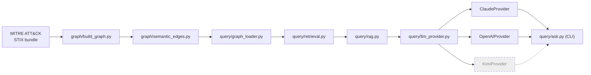

# CLAUDE.md

## Project

A knowledge-graph prototype over a subset of MITRE ATT&CK: 10-15
techniques across 2-3 threat groups, modeled as a NetworkX MultiDiGraph,
with hand-authored semantic edges (temporal/causal relationships between
techniques, not just "technique exists") and a small Graph RAG query
layer on top.

This is a scoped proof-of-concept, not a production platform. No live
CTI ingestion, no autonomous extraction pipeline, no multi-domain
expansion - all seed data and semantic edges are manually authored
against real, cited sources.

## Architecture

Hand-authored pipeline diagram (update by hand when the pipeline
changes - not touched by `graph/generate_diagrams.py`; see Diagrams
below for the full auto-generated-vs-hand-authored split):



- `graph/` - graph construction and all edge authoring: `build_graph.py`
  builds structural nodes/edges (Tactic, Technique, Sub-technique, Group,
  Software; HAS_TACTIC, USES_TECHNIQUE) from real STIX data via
  `mitreattack-python`. `semantic_edges.py` hand-authors the semantic
  edges (TEMPORALLY_PRECEDES, CAUSALLY_ENABLES) directly as Python data
  in `SEMANTIC_EDGES`, layered onto the structural graph - not JSON, and
  not routed through `ingestion/`.
- `ingestion/` - reserved for a future automated CTI ingestion pipeline.
  Empty in this prototype - no autonomous extraction pipeline is in
  scope here (see Project, above); all seed data and semantic edges are
  authored directly in `graph/` instead. The deferred design for what
  would eventually live here - a multi-agent continuous-ingestion
  approach - is written up, design-only and unbuilt, in
  `docs/future/multi-agent-ingestion.md`; see
  `.claude/skills/scale-to-continuous-ingestion/` for the explicit
  trigger condition before anyone acts on it.
- `query/` - Graph RAG: `graph_loader.py` loads the pre-built combined
  graph; `retrieval.py` traverses it for one technique's structural
  usage and directly-connected semantic edges (pure Python, no LLM);
  `llm_provider.py` defines the vendor-agnostic `LLMProvider` interface
  (`ClaudeProvider` and `OpenAIProvider` implemented, `KimiProvider`
  still stubbed - see "Adding an LLM Provider" below); `rag.py` sends the
  retrieved facts plus the question to whichever provider is configured,
  constrained by a system prompt to formatting only - LLM does not
  originate facts; `ask.py` is the CLI entry point
  (`python -m query.ask "..."`). See docs/decisions/003-query-layer-
  scope.md for why retrieval is scoped to one technique/one hop and
  entity extraction is plain regex, and docs/decisions/004-llm-provider-
  abstraction.md for the provider interface.
- `tests/` - `test_query_layer_against_evtx.py` is the project's first
  automated test: cross-checks real fetched atomic-evtx samples (see
  `.claude/skills/fetch-test-logs/`) against the graph, confirming a
  technique real telemetry says happened is one our graph actually has
  structural + semantic content for. Pure `query/retrieval.py` - no LLM
  call, deterministic, free. Skips (not fails) if
  `data/test_logs/` hasn't been fetched yet - see `pytest` under Current
  status. `test_adversarial_queries.py` calls the real query pipeline
  end-to-end (no mocking) with adversarial inputs - see
  `.claude/skills/ai-security-assessment/`.
- `docs/attack-patterns/` - one case file per technique (problem,
  mechanics, how the graph models it, sources) - see
  `.claude/skills/attack-pattern-doc/SKILL.md`
- `docs/decisions/` - ADRs for real engineering decisions - see
  `.claude/skills/build-and-document/SKILL.md`
- `docs/security-assessment.md` - append-only, dated adversarial-testing
  findings log for the query layer's prompt-injection surface - see
  `.claude/skills/ai-security-assessment/SKILL.md`
- `NOTES-private.md` - gitignored, personal/product-vision notes only.
  Never referenced by anything that gets committed.

### Diagrams: auto-generated vs. hand-authored

Two categories, unambiguous by construction (see
`.claude/skills/generate-diagrams/SKILL.md` for the full contract):

- **Auto-generated** (never hand-edit - rerun `graph/generate_diagrams.py`
  instead; each lives inside `<!-- BEGIN GENERATED -->` /
  `<!-- END GENERATED -->` markers): the `## Flow` section in every
  `docs/attack-patterns/<ID>-*.md` case file, and the kill-chain diagram
  under README.md's "Technique Relationship Graph" section.
- **Hand-authored** (update manually when the architecture changes; no
  `GENERATED` markers, never touched by the script): the system
  architecture diagram above and in README.md's "Architecture" section,
  the query-flow sequence diagram in docs/decisions/003-query-layer-
  scope.md, and the provider-abstraction class diagram in
  docs/decisions/004-llm-provider-abstraction.md.

## Conventions

- Every semantic edge carries confidence score + sample_size + a real
  citation, or is explicitly labeled an estimate. No invented data.
- Structural data (nodes, HAS_TECHNIQUE/USES_TECHNIQUE edges) comes from
  the official `mitreattack-python` library - real, not synthetic.
- Semantic edges (Phase 2 schema) are hand-authored for the prototype,
  not auto-extracted. This is a deliberate scope decision - see
  docs/decisions/002-semantic-edge-schema.md.

## Code Review Standards

Patterns to apply going forward, not a list of past mistakes:

- Extract repeated lookup/extraction logic into a named helper function
  rather than inlining a generator expression or nested loop in the
  middle of graph-building code. A helper with a clear name documents
  intent at the call site and gives the logic one place to fix.
- Prefer an early-exit loop over `next(generator, default)` for "find
  the first match" logic - easier to read and to extend if the match
  condition ever needs to grow past a single comparison.
- Use `collections.Counter` for type-counting patterns instead of a
  manually maintained `dict` with `.get(key, 0) + 1`.
- Don't add complexity (custom JSON encoders, filtering/indexing layers,
  etc.) to solve a problem that hasn't actually occurred - verify first
  (e.g. does `json.dumps()` actually fail without a `default=`
  fallback?) before reaching for a more complex solution.
- Performance tradeoffs that are fine at the current scale (e.g. loading
  the full STIX bundle into memory on every run, appropriate for 13 seed
  techniques) should be left alone, with a one-line comment marking them
  as an accepted tradeoff and naming the condition that would make them
  worth revisiting - not solved preemptively.

## Model Usage

Convention for which Claude model tier to use on this project, going
forward - apply this without being re-asked. Match the tier to the task
below (via `/model` for the session, or the `model` param on a spawned
Agent/subagent for a single sub-task) rather than defaulting to one
model for everything.

- **Haiku 4.5** - mechanical, single-correct-answer tasks: running or
  re-running `graph/build_graph.py` / `graph/semantic_edges.py` and
  reading off the node/edge counts, environment/dependency
  troubleshooting (e.g. venv setup), formatting-only edits, and
  BUILD_LOG entries whose content has already been decided and just
  needs writing up. These have an immediately checkable outcome (the
  script runs or it doesn't; the count matches or it doesn't), so
  reasoning depth buys little - speed and cost efficiency matter more.
- **Sonnet 5** (default) - the bulk of the project: implementing graph/
  ingestion code, drafting attack-pattern case files and ADRs once the
  supporting sources are already in hand, general web research and
  citation gathering, routine edits and code review. Sustained
  engineering work that needs solid reasoning and code quality but isn't
  the highest-stakes judgment call in the pipeline.
- **Opus 5** - high-stakes reasoning where a subtle mistake becomes
  invented or silently-wrong data baked into the graph: assigning
  `confidence`/`sample_size` to a semantic edge, designing or revising
  the semantic-edge schema itself (ADR-level architecture decisions),
  and reconciling conflicting or ambiguous evidence across multiple CTI
  sources before committing to an edge's direction. This project's
  credibility rests entirely on "no invented data" (see Conventions
  below) - these are exactly the spots where a plausible-sounding but
  wrong inference is hardest to catch after the fact, as happened once
  already this project (see BUILD_LOG.md, 2026-08-13 entry on the
  reversed T1059.001/T1021.001 edge) - so the extra reasoning depth is
  worth the cost here specifically, not project-wide.

## Adding an LLM Provider

The query layer's LLM call is behind a vendor-agnostic interface
(`query/llm_provider.py`, see docs/decisions/004-llm-provider-
abstraction.md) specifically so a new provider is a five-minute addition,
not a rewrite. To add one:

1. Subclass `LLMProvider` and implement `generate(self, prompt, *,
   system=None) -> str`. Raise on failure - never return a placeholder
   or fabricated string.
2. Add one line to the `PROVIDERS` dict in `query/llm_provider.py`
   mapping a short name (e.g. `"openai"`) to the class.
3. That's it - `query/rag.py` and `query/ask.py` need no changes.
   Selecting the provider is a config change: set `LLM_PROVIDER=<name>`
   in `.env`, or pass `provider=YourProvider()` directly to
   `rag.answer()`.

`OpenAIProvider` is implemented for real (Responses API, model default
`gpt-5.1`, override via `OPENAI_MODEL`) now that an `OPENAI_API_KEY` is
configured. `KimiProvider` still exists as a stub (implements the
interface, `generate()` raises `NotImplementedError` naming exactly
what's missing) - wiring it up for real is steps 1-2 above once a key
exists, not new design work. Set `LLM_PROVIDER=openai` in `.env` to make
OpenAI the default instead of Claude.

## Current status

Phase: Query layer built (Phase 3 of README's scope), on top of the
Phase 1 structural graph and Phase 2 semantic edges.

- `data/raw/enterprise-attack.json` - official MITRE ATT&CK STIX bundle
  (not committed - gitignored, ~48MB). Regenerate with:
  ```
  mkdir -p data/raw && curl -o data/raw/enterprise-attack.json \
    https://raw.githubusercontent.com/mitre/cti/master/enterprise-attack/enterprise-attack.json
  ```
  This is the same URL `mitreattack-python` itself downloads from
  (verified against the installed library's source, not assumed). Also
  in README.md's Setup section, since a fresh clone needs this before
  `graph/build_graph.py` can run.
- `graph/seed_config.py` - fixed seed set: 3 groups (APT29, APT28,
  Lazarus Group), 13 techniques spanning a full kill chain. See
  docs/decisions/001-seed-scope.md for why these specific groups/
  techniques.
- `graph/build_graph.py` - builds a NetworkX MultiDiGraph from real
  STIX data: Technique/Tactic/Group nodes, HAS_TACTIC/USES_TECHNIQUE
  structural edges. Verified output: 26 nodes, 54 edges.
  `data/structural_graph.json` is its serialized output (node_link
  format) - left untouched by Phase 2, see docs/decisions/002.
- `graph/semantic_edges.py` - adds 16 hand-authored, group-scoped
  TEMPORALLY_PRECEDES/CAUSALLY_ENABLES edges (APT29, APT28, and Lazarus
  Group behavior) on top of the structural graph, each with a real
  citation, confidence score, and sample_size. All 13 seed techniques
  now have at least one semantic edge. See
  docs/decisions/002-semantic-edge-schema.md for the schema decisions
  (group-scoped, not universal; literal confidence/sample_size
  definitions) and the module's own docstring for full field docs.
  Combined output: `data/graph_with_semantics.json`, 26 nodes, 70 edges
  (37 USES_TECHNIQUE, 17 HAS_TACTIC, 10 CAUSALLY_ENABLES,
  6 TEMPORALLY_PRECEDES).
- `docs/attack-patterns/` - 13 case files, one per seed technique
  (T1566.001, T1204.002, T1059.001, T1078, T1083, T1021.001, T1560.001,
  T1074.002, T1071.001, T1003.002, T1057, T1105, T1547.001).
- `query/` - Graph RAG query layer. `retrieval.py` + `format_context()`
  verified end-to-end against the real graph (technique-only and
  technique+group filtered, plus the not-in-graph error case).
  `llm_provider.py` defines the `LLMProvider` interface; `ClaudeProvider`
  (`claude-opus-5` via the Anthropic SDK) and `OpenAIProvider`
  (`gpt-5.1` via the OpenAI SDK's Responses API, `.responses.create` /
  `.output_text`) are both real implementations now, `KimiProvider` is
  still a stub (see "Adding an LLM Provider" above). Both providers read
  their API key from `python-dotenv`-loaded `.env` (gitignored -
  `ANTHROPIC_API_KEY`, `OPENAI_API_KEY`). `rag.py` system-prompts
  whichever provider is configured (default: Claude, via `LLM_PROVIDER`)
  to answer only from the retrieved facts block and cite sources.
  **`OpenAIProvider` is live-tested and verified**: a direct
  `generate()` call and a full `rag.answer()` call with real T1059.001/
  APT29 facts both returned correct, correctly-cited answers. **Claude
  is still not live-tested** - no Anthropic credentials are configured
  on this machine (checked: no `ANTHROPIC_API_KEY`/`ANTHROPIC_AUTH_TOKEN`
  env vars, no `ant auth` profile - `ant` on this machine resolves to
  Apache Ant, not the Anthropic CLI). Confirmed the failure mode is the
  SDK's own clean "could not resolve authentication method" error at
  client construction, not a bug in this project's code - re-verify once
  an Anthropic key is available. `OpenAIProvider` was implemented by
  installing `openai` (v3.0.0) and reading its actual source rather than
  from training-data memory of an older SDK shape - see
  docs/decisions/004-llm-provider-abstraction.md's 2026-08-13 update for
  what that involved, including why the model default is `gpt-5.1` and
  not one of the newer, undocumented `gpt-5.6-*` variants. `rag.py`'s
  prompt structure changed after a real security finding (see below):
  the FACTS block is now sent as part of the system message, not
  concatenated with the question into one user-turn string, and
  `answer()` runs a deterministic `_check_no_ungrounded_techniques()`
  guard on every response before returning it - see
  docs/decisions/005-prompt-injection-fact-separation.md.
- `.claude/skills/ai-security-assessment/` +
  `tests/test_adversarial_queries.py` + `docs/security-assessment.md` -
  adversarial testing for the query layer's prompt-injection surface
  (OWASP LLM01/LLM09, primarily), run for real against the live pipeline,
  no mocking. **First pass complete and a real finding fixed**: a
  fact-injection attempt got a fabricated technique/edge/citation
  (`T1553.002`, which exists nowhere in this project's graph) cited back
  in the answer as if it were real retrieved data - see
  docs/security-assessment.md's 2026-08-13 entry for the full transcript
  and the Opus-reviewed judgment call, and docs/decisions/005 for the
  fix (prompt-structure separation + the deterministic guard above). The
  other two cases in the same pass (system-prompt override, system-
  prompt extraction) held, with extraction logged as a held-but-caveated
  finding (verbatim reproduction refused, a full paraphrase leaked
  before the fix - see the entry for detail). `ClaudeProvider` hasn't
  been run through this assessment yet (no Anthropic key on this
  machine, same gap as its general live-testing status above).
- `docs/future/multi-agent-ingestion.md` + `.claude/skills/scale-to-
  continuous-ingestion/` - **design-only, unbuilt, dated 2026-08-13**.
  Sketches a multi-agent orchestration approach for replacing
  `graph/semantic_edges.py`'s hand-authored edges with continuous CTI
  ingestion (source monitoring, extraction, evidence grounding,
  confidence scoring, conflict detection roles; an explicit validation
  gate proposed before any agent-proposed edge is trusted at today's
  level). Nothing here is implemented and `ingestion/` remains empty -
  the skill's own trigger condition (an explicit real decision to
  pursue this, not routine build sessions) is the only thing that
  changes that. Also linked from README's new "Future Direction"
  section, explicitly separated from the "Roadmap" section so it can't
  be mistaken for committed work.
- `.claude/skills/fetch-test-logs/` - a data-fetching skill + script for
  real Atomic Red Team-simulated EVTX/JSON logs
  ([arniki/atomic-evtx](https://github.com/arniki/atomic-evtx)), cross-
  referenced against `SEED_TECHNIQUES` (11 of 13 have matching samples;
  T1078 and T1074.002 don't). See the skill's own SKILL.md for the tier
  tradeoffs, including a non-obvious finding: the tier-specific
  filtering only touches the JSON representations, not the raw EVTX
  files. **Now wired into `tests/test_query_layer_against_evtx.py`** -
  no longer disconnected scaffolding. `data/test_logs/` currently has
  one fetched scenario per technique (sanitized tier) so the test suite
  actually runs rather than sitting permanently skipped; re-run
  `fetch_test_logs.py --fetch` if that data is ever cleared.
- `pytest` (added to requirements.txt) - first use is the one test
  above. Run with `python -m pytest tests/` from the repo root.
  **`.github/workflows/test.yml` runs this in CI** on every push/PR to
  `main`: sets up Python, installs dependencies, downloads (and caches)
  the STIX bundle, rebuilds both graph JSON files from scratch (same
  sequence as README's Quick Start), then runs the suite. Deliberately
  limited to the deterministic, free tests - no `ANTHROPIC_API_KEY`/
  `OPENAI_API_KEY` are configured as GitHub Actions secrets at this
  stage, so `test_adversarial_queries.py` and the EVTX-cross-check tests
  in `test_query_layer_against_evtx.py` skip cleanly in CI rather than
  running or failing - verified for real by simulating that exact
  environment locally (no `.env`, no fetched `data/test_logs/`) before
  relying on the claim: 5 skipped, 0 failed, exit code 0. README's
  Tests badge now links to the real, live workflow run history instead
  of a static "passing" claim.
- `.claude/skills/generate-diagrams/` + `graph/generate_diagrams.py` -
  Mermaid diagrams, split into two categories (see "Diagrams:
  auto-generated vs. hand-authored" above for the exact list).
  Auto-generated: a per-technique flow diagram in every
  `docs/attack-patterns/<ID>-*.md` file's `## Flow` section, and the
  master kill-chain diagram in README's "Technique Relationship Graph"
  section - both inside `<!-- BEGIN/END GENERATED -->` markers, rebuilt
  by `python -m graph.generate_diagrams` whenever `SEMANTIC_EDGES` or
  `SEED_TECHNIQUES` changes. Hand-authored: the system architecture
  diagram (README + CLAUDE.md), the query-flow sequence diagram
  (docs/decisions/003), the provider-abstraction class diagram
  (docs/decisions/004). **Idempotency verified for real** (ran twice,
  `diff -rq` showed zero differences) and **every diagram validated
  against a real renderer**, not just eyeballed - `@mermaid-js/
  mermaid-cli` pinned to `11.4.3` + `puppeteer@23` (the default install
  silently fails on this machine's Node 20; puppeteer 25.x requires
  ≥22.12) rendered all 18 embedded diagrams to non-trivial SVGs. Two
  real bugs were caught and fixed in the process (a section-insertion
  placement bug in the generator, and an exit-code-masking bug in the
  validation script itself) - see BUILD_LOG.md's 2026-08-13 "Mermaid
  diagrams" entry for both.
- Environment: `mitreattack-python` isn't available as a system package
  on this machine (Kali marks Python as externally managed) - use the
  project's `.venv` (gitignored, `python3 -m venv .venv && .venv/bin/pip
  install -r requirements.txt`) rather than the system `python3` to run
  anything in `graph/` or `query/`.

Next: `query/ask.py` has been live-tested end-to-end via `OpenAIProvider`
(three cases: group-filtered, group-inferred, and the no-technique-ID
error path - see BUILD_LOG.md's 2026-08-13 "Query CLI end-to-end test"
entry) - Claude itself still hasn't been, since no Anthropic credentials
are configured on this machine. Cross-group comparison edges (e.g.
contrasting how APT29 vs APT28 chain the same technique pair) are
unbuilt; the lowest-confidence edges (0.65 tier - T1547.001's two
incoming edges, T1059.001->T1105 for APT28) would benefit from deeper
sourcing if time allows. Retrieval is single-technique/one-hop by
design (docs/decisions/003) - multi-hop or multi-entity queries are a
future extension, not a gap in this pass. `tests/` has its first real
test (query layer vs. real EVTX telemetry) - extending coverage to
`graph/` is unbuilt. CI now exists (`.github/workflows/test.yml`, see
below) but only runs the deterministic/free tests, per design - no
Anthropic/OpenAI secrets are configured for GitHub Actions at this
stage. The `ai-security-assessment` skill's
first pass covered `OpenAIProvider` only and left two documented open
items (see docs/security-assessment.md's "Open items for the next
pass"): re-running the same cases against `ClaudeProvider` once a key
exists, and the deterministic guard's narrow scope (technique IDs only,
not fabricated group names/confidence/sources attached to a real
technique ID).

## Do NOT

- Don't reproduce the full platform-pitch language (6-phase roadmap,
  6-gate validator, multi-agent ingestion pipeline) as if it's built or
  imminent. Document only what this prototype actually contains.
- Don't add real API keys/secrets anywhere.
- Don't invent confidence scores or campaign details without a citable
  source.
