# attck-graph

A knowledge-graph prototype over a scoped subset of MITRE ATT&CK, modeling
not just *which* techniques a threat group uses, but the relationships
between them - what tends to precede what, what enables what, and where
detection coverage gaps exist.

## Why

MITRE ATT&CK catalogs techniques as a taxonomy. It doesn't model sequence,
timing, prerequisites, or confidence - so knowing "APT29 uses T1059.001
and T1003" doesn't tell a defender what to expect next, how urgently, or
whether existing detections actually cover the path an attacker takes.
This project explores modeling that as a graph: structural ATT&CK data as
a base layer, hand-authored semantic edges (temporal/causal relationships,
cited against real sources) on top, and a small retrieval layer so the
graph can answer questions like "given this observed technique, what's
likely next and do we have coverage."

## Scope (honest version)

This is a prototype covering **10-15 techniques across 2-3 threat groups**,
not a production system:
- Structural graph (nodes, HAS_TECHNIQUE/USES_TECHNIQUE edges): real data
  via the official `mitreattack-python` library.
- Semantic edges (temporal/causal relationships): hand-authored against
  cited public CTI sources - not an automated extraction pipeline.
- Query layer: graph traversal + LLM-formatted answer, grounded in the
  retrieved subgraph only.

See `docs/attack-patterns/` for the per-technique writeups (what the
attack is, the gap in existing tooling, how it's modeled here, sources)
and `docs/decisions/` for engineering decision records.

## Technique Relationship Graph

Auto-generated from `data/graph_with_semantics.json` by
`graph/generate_diagrams.py` - see `.claude/skills/generate-diagrams/`.
Don't hand-edit the block below; rerun the generator instead.

```mermaid
flowchart LR
    T_T1003_002["T1003.002<br/>Security Account Manager"]
    T_T1021_001["T1021.001<br/>Remote Desktop Protocol"]
    T_T1057["T1057<br/>Process Discovery"]
    T_T1059_001["T1059.001<br/>PowerShell"]
    T_T1071_001["T1071.001<br/>Web Protocols"]
    T_T1074_002["T1074.002<br/>Remote Data Staging"]
    T_T1078["T1078<br/>Valid Accounts"]
    T_T1083["T1083<br/>File and Directory Discovery"]
    T_T1105["T1105<br/>Ingress Tool Transfer"]
    T_T1204_002["T1204.002<br/>Malicious File"]
    T_T1547_001["T1547.001<br/>Registry Run Keys / Startup Folder"]
    T_T1560_001["T1560.001<br/>Archive via Utility"]
    T_T1566_001["T1566.001<br/>Spearphishing Attachment"]
    T_T1021_001 -->|"APT28"| T_T1059_001
    T_T1057 -.->|"APT29"| T_T1083
    T_T1059_001 -.->|"APT29"| T_T1078
    T_T1059_001 -->|"APT28"| T_T1105
    T_T1059_001 -->|"APT28"| T_T1547_001
    T_T1078 -->|"APT28"| T_T1003_002
    T_T1078 -->|"APT28"| T_T1021_001
    T_T1078 -.->|"APT29"| T_T1057
    T_T1078 -->|"APT28"| T_T1059_001
    T_T1083 -.->|"Lazarus Group"| T_T1560_001
    T_T1105 -->|"APT29"| T_T1003_002
    T_T1105 -->|"APT29"| T_T1547_001
    T_T1204_002 -->|"APT29"| T_T1059_001
    T_T1560_001 -->|"Lazarus Group"| T_T1071_001
    T_T1560_001 -.->|"APT29"| T_T1074_002
    T_T1566_001 -.->|"APT29"| T_T1204_002
    linkStyle 0 stroke:#C44E52,stroke-width:2px
    linkStyle 1 stroke:#4C72B0,stroke-width:2px
    linkStyle 2 stroke:#4C72B0,stroke-width:2px
    linkStyle 3 stroke:#C44E52,stroke-width:2px
    linkStyle 4 stroke:#C44E52,stroke-width:2px
    linkStyle 5 stroke:#C44E52,stroke-width:2px
    linkStyle 6 stroke:#C44E52,stroke-width:2px
    linkStyle 7 stroke:#4C72B0,stroke-width:2px
    linkStyle 8 stroke:#C44E52,stroke-width:2px
    linkStyle 9 stroke:#55A868,stroke-width:2px
    linkStyle 10 stroke:#4C72B0,stroke-width:2px
    linkStyle 11 stroke:#4C72B0,stroke-width:2px
    linkStyle 12 stroke:#4C72B0,stroke-width:2px
    linkStyle 13 stroke:#55A868,stroke-width:2px
    linkStyle 14 stroke:#4C72B0,stroke-width:2px
    linkStyle 15 stroke:#4C72B0,stroke-width:2px
```

<!-- BEGIN GENERATED: graph/generate_diagrams.py (do not hand-edit; rerun the script) -->


*Edge color by group: APT28 = `#C44E52`, APT29 = `#4C72B0`, Lazarus Group = `#55A868`. Dashed = TEMPORALLY_PRECEDES, solid = CAUSALLY_ENABLES.*
<!-- END GENERATED -->

## Status

Early build - see `BUILD_LOG.md` for session-by-session progress.

## Setup

```bash
pip install -r requirements.txt

# fetch the official MITRE ATT&CK STIX bundle (gitignored, ~48MB, not committed)
mkdir -p data/raw && curl -o data/raw/enterprise-attack.json \
  https://raw.githubusercontent.com/mitre/cti/master/enterprise-attack/enterprise-attack.json

python -m graph.build_graph      # structural graph -> data/structural_graph.json
python -m graph.semantic_edges   # + semantic edges -> data/graph_with_semantics.json

# query layer needs an Anthropic API key - put it in .env (gitignored):
echo 'ANTHROPIC_API_KEY=sk-ant-...' > .env
python -m query.ask "what happens after T1059.001 for APT29?"
```
