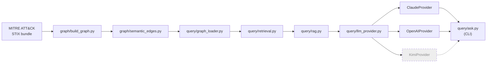

# attck-graph

[](https://www.python.org/)
[](https://networkx.org/)
[](https://github.com/HungryBrain-bot/attackKnowledgeGraph/actions/workflows/test.yml)
[](LICENSE)

A knowledge-graph prototype over a scoped subset of MITRE ATT&CK, modeling
not just *which* techniques a threat group uses, but the relationships
between them - what tends to precede what, what enables what, and where
detection coverage gaps exist.

## See it run

Real output from `python -m query.ask`, captured from an actual run
against the graph (`LLM_PROVIDER=openai`; see BUILD_LOG.md's 2026-08-13
"Query CLI end-to-end test" entry for the other two verified cases) - not
a mockup:

```
$ python -m query.ask "what happens after T1059.001 for APT29?"

--- Retrieved facts (from the graph, not the LLM) ---
TECHNIQUE: T1059.001 - PowerShell
Tactics: execution
Description: Adversaries may abuse PowerShell commands and scripts for
execution. PowerShell is a powerful interactive command-line interface
and scripting environment included in the Windows operating
system.(Citation: TechNet PowerShell) [...]

Used by (structural, from official MITRE ATT&CK data):
  - APT29 (sources: CrowdStrike StellarParticle January 2022, ESET T3
    Threat Report 2021, Mandiant No Easy Breach, Mandiant UNC2452 APT29
    April 2022, Microsoft Analyzing Solorigate Dec 2020, NSA Joint
    Advisory SVR SolarWinds April 2021, [...])

Semantic edges (filtered to group: APT29):
  - [APT29] T1059.001 --TEMPORALLY_PRECEDES--> T1078 (Valid Accounts)
    confidence: 0.85, sample_size: 2, sources: Mandiant UNC2452 APT29
    April 2022, NSA Joint Advisory SVR SolarWinds April 2021
    evidence: Mandiant's UNC2452/APT29 writeup states the group was able
    to gain Domain Administrator privileges 'less than 12 hours after
    the initial execution of a phishing payload' [...]
  - [APT29] T1204.002 (Malicious File) --CAUSALLY_ENABLES--> T1059.001
    confidence: 0.8, sample_size: 3, [...]

--- Answer ---
For APT29, T1059.001 (PowerShell) has been observed to TEMPORALLY_PRECEDE
T1078 (Valid Accounts). Specifically, in the SolarWinds/SUNBURST
intrusion, Mandiant reported that APT29 obtained Domain Administrator
privileges in under 12 hours after initial phishing payload execution
that involved PowerShell/Cobalt Strike loaders, linking early PowerShell
execution to later use of privileged/valid accounts (Mandiant UNC2452
APT29 April 2022; NSA Joint Advisory SVR SolarWinds April 2021).
```

Every fact above the `--- Answer ---` line comes from deterministic graph
traversal, not the LLM (see docs/decisions/003-query-layer-scope.md) -
the retrieved-facts block is printed alongside the answer specifically so
a reviewer never has to trust the citations blind.

## Why

MITRE ATT&CK catalogs techniques as a taxonomy. It doesn't model sequence,
timing, prerequisites, or confidence - so knowing "APT29 uses T1059.001
and T1003" doesn't tell a defender what to expect next, how urgently, or
whether existing detections actually cover the path an attacker takes.
This project explores modeling that as a graph: structural ATT&CK data as
a base layer, hand-authored semantic edges (temporal/causal relationships,
cited against real sources) on top, and a small retrieval layer so the
graph can answer questions like "given this observed technique, what's
likely next and do we have coverage."

## ATT&CK Navigator vs. this project

Pulled directly from `docs/attack-patterns/`'s per-technique "Present
Problem" sections (each cited against real CTI sources - see the case
files for full sourcing), not new claims written for this table:

| Question a defender actually has | ATT&CK Navigator / static lookup | attck-graph |
|---|---|---|
| "APT29 opened a phishing attachment - what happens next?" | Confirms APT29 uses T1566.001. Doesn't say what follows. | For APT29, T1566.001 is reliably followed by a PowerShell-launching macro (T1204.002), not an embedded exploit or dropped EXE (confidence 0.75, sample_size 3). |
| "We see PowerShell execution attributed to a known group - how urgent is it?" | Confirms the group uses T1059.001. PowerShell is present in most intrusions, benign and malicious alike, so this alone is close to a non-signal. | Distinguishes APT29's initial-access-adjacent execution from APT28's mid-intrusion recon off an already-compromised pivot host - different triage priorities entirely (docs/attack-patterns/T1059.001-powershell.md). |
| "A credential compromise is suspected - what should we watch for next?" | Confirms the group uses T1078 (Valid Accounts). Valid-account activity is indistinguishable from legitimate use at the log level, so the lookup alone gives no next step. | Surfaces what tends to follow a suspected credential compromise for that specific actor, so monitoring can front-load onto the *next* step (docs/attack-patterns/T1078-valid-accounts.md). |
| "Process discovery activity is confirmed for this actor - where are we in the chain?" | Confirms the group uses T1057. Commands like `tasklist`/`Get-Process` run constantly for benign reasons, so the raw event alone is close to undetectable as a signal. | Distinguishes early reconnaissance from an unprivileged foothold from a survey step that only happens once the attacker already has Domain Admin, per APT29's documented SolarWinds pattern (docs/attack-patterns/T1057-process-discovery.md). |

## Architecture

Hand-authored - depicts module/call structure, not graph data, so it
isn't touched by `graph/generate_diagrams.py` (see `.claude/skills/
generate-diagrams/`). Update by hand when the pipeline itself changes.



*Dashed `KimiProvider` = stub, not yet implemented (see
docs/decisions/004-llm-provider-abstraction.md).*

## Scope (honest version)

This is a prototype covering **10-15 techniques across 2-3 threat groups**,
not a production system:
- Structural graph (nodes, HAS_TECHNIQUE/USES_TECHNIQUE edges): real data
  via the official `mitreattack-python` library.
- Semantic edges (temporal/causal relationships): hand-authored against
  cited public CTI sources - not an automated extraction pipeline.
- Query layer: graph traversal + LLM-formatted answer, grounded in the
  retrieved subgraph only.

See `docs/attack-patterns/` for the per-technique writeups (what the
attack is, the gap in existing tooling, how it's modeled here, sources)
and `docs/decisions/` for engineering decision records.

## Technique Relationship Graph

Auto-generated from `data/graph_with_semantics.json` by
`graph/generate_diagrams.py` - see `.claude/skills/generate-diagrams/`.
Don't hand-edit the block below; rerun the generator instead.

```mermaid
flowchart LR
    T_T1003_002["T1003.002<br/>Security Account Manager"]
    T_T1021_001["T1021.001<br/>Remote Desktop Protocol"]
    T_T1057["T1057<br/>Process Discovery"]
    T_T1059_001["T1059.001<br/>PowerShell"]
    T_T1071_001["T1071.001<br/>Web Protocols"]
    T_T1074_002["T1074.002<br/>Remote Data Staging"]
    T_T1078["T1078<br/>Valid Accounts"]
    T_T1083["T1083<br/>File and Directory Discovery"]
    T_T1105["T1105<br/>Ingress Tool Transfer"]
    T_T1204_002["T1204.002<br/>Malicious File"]
    T_T1547_001["T1547.001<br/>Registry Run Keys / Startup Folder"]
    T_T1560_001["T1560.001<br/>Archive via Utility"]
    T_T1566_001["T1566.001<br/>Spearphishing Attachment"]
    T_T1021_001 -->|"APT28"| T_T1059_001
    T_T1057 -.->|"APT29"| T_T1083
    T_T1059_001 -.->|"APT29"| T_T1078
    T_T1059_001 -->|"APT28"| T_T1105
    T_T1059_001 -->|"APT28"| T_T1547_001
    T_T1078 -->|"APT28"| T_T1003_002
    T_T1078 -->|"APT28"| T_T1021_001
    T_T1078 -.->|"APT29"| T_T1057
    T_T1078 -->|"APT28"| T_T1059_001
    T_T1083 -.->|"Lazarus Group"| T_T1560_001
    T_T1105 -->|"APT29"| T_T1003_002
    T_T1105 -->|"APT29"| T_T1547_001
    T_T1204_002 -->|"APT29"| T_T1059_001
    T_T1560_001 -->|"Lazarus Group"| T_T1071_001
    T_T1560_001 -.->|"APT29"| T_T1074_002
    T_T1566_001 -.->|"APT29"| T_T1204_002
    T_T1566_001 -.->|"Lazarus Group"| T_T1204_002
    linkStyle 0 stroke:#C44E52,stroke-width:2px
    linkStyle 1 stroke:#4C72B0,stroke-width:2px
    linkStyle 2 stroke:#4C72B0,stroke-width:2px
    linkStyle 3 stroke:#C44E52,stroke-width:2px
    linkStyle 4 stroke:#C44E52,stroke-width:2px
    linkStyle 5 stroke:#C44E52,stroke-width:2px
    linkStyle 6 stroke:#C44E52,stroke-width:2px
    linkStyle 7 stroke:#4C72B0,stroke-width:2px
    linkStyle 8 stroke:#C44E52,stroke-width:2px
    linkStyle 9 stroke:#55A868,stroke-width:2px
    linkStyle 10 stroke:#4C72B0,stroke-width:2px
    linkStyle 11 stroke:#4C72B0,stroke-width:2px
    linkStyle 12 stroke:#4C72B0,stroke-width:2px
    linkStyle 13 stroke:#55A868,stroke-width:2px
    linkStyle 14 stroke:#4C72B0,stroke-width:2px
    linkStyle 15 stroke:#4C72B0,stroke-width:2px
    linkStyle 16 stroke:#55A868,stroke-width:2px
```

<!-- BEGIN GENERATED: graph/generate_diagrams.py (do not hand-edit; rerun the script) -->


*Edge color by group: APT28 = `#C44E52`, APT29 = `#4C72B0`, Lazarus Group = `#55A868`. Dashed = TEMPORALLY_PRECEDES, solid = CAUSALLY_ENABLES.*
<!-- END GENERATED -->

## Repository structure

Matches CLAUDE.md's Architecture section exactly - if these two ever
describe different structures, one of them is stale.

```
graph/                 structural graph + semantic edges + diagram generation
  build_graph.py        real STIX data -> NetworkX MultiDiGraph (Technique/Tactic/
                         Group nodes, HAS_TACTIC/USES_TECHNIQUE edges)
  semantic_edges.py      hand-authored TEMPORALLY_PRECEDES/CAUSALLY_ENABLES edges,
                         each with confidence + sample_size + a real citation
  seed_config.py         fixed seed set: 3 groups, 13 techniques
  generate_diagrams.py   auto-generates Mermaid diagrams from the built graph

ingestion/              reserved for a future automated CTI ingestion pipeline
                         (empty in this prototype - out of scope, see CLAUDE.md)

query/                  Graph RAG query layer
  graph_loader.py        loads the pre-built combined graph
  retrieval.py            traverses it for one technique's structural usage
                         + directly-connected semantic edges (pure Python, no LLM)
  llm_provider.py         vendor-agnostic LLMProvider interface (Claude/OpenAI
                         real, Kimi stubbed)
  rag.py                  sends retrieved facts + question to the configured
                         provider, constrained to formatting only
  ask.py                  CLI entry point (python -m query.ask "...")

tests/                  test_query_layer_against_evtx.py - cross-checks real
                         atomic-evtx telemetry against the graph (pure retrieval,
                         no LLM call; skips if data/test_logs/ isn't fetched)

docs/attack-patterns/   one case file per seed technique (problem, mechanics,
                         how the graph models it, sources)
docs/decisions/         ADRs for real engineering decisions

.claude/skills/         build-and-document, attack-pattern-doc, fetch-test-logs,
                         generate-diagrams

NOTES-private.md        gitignored, personal/product-vision notes only
```

## Quick Start

```bash
git clone <this-repo>
cd attck-graph

# Kali (and other externally-managed-Python distros) refuse system-wide
# pip installs - use a project venv instead of the system python3.
python3 -m venv .venv
.venv/bin/pip install -r requirements.txt

# fetch the official MITRE ATT&CK STIX bundle (gitignored, ~48MB, not committed)
mkdir -p data/raw && curl -o data/raw/enterprise-attack.json \
  https://raw.githubusercontent.com/mitre/cti/master/enterprise-attack/enterprise-attack.json

.venv/bin/python -m graph.build_graph      # structural graph -> data/structural_graph.json
.venv/bin/python -m graph.semantic_edges   # + semantic edges -> data/graph_with_semantics.json

# run the test suite - the EVTX-cross-check tests skip (not fail) until you
# run .claude/skills/fetch-test-logs/fetch_test_logs.py --fetch; pass count
# depends on how many seed techniques you've fetched samples for, so no
# fixed number is promised here - see tests/test_query_layer_against_evtx.py
.venv/bin/python -m pytest tests/

# query layer needs an LLM provider key - put one in .env (gitignored):
echo 'ANTHROPIC_API_KEY=sk-ant-...' > .env
# or: echo 'OPENAI_API_KEY=sk-...' > .env && echo 'LLM_PROVIDER=openai' >> .env

.venv/bin/python -m query.ask "what happens after T1059.001 for APT29?"
```

## Future Direction

Speculative, not committed - unlike the Roadmap below, nothing here is
planned work. `graph/semantic_edges.py`'s hand-authored edges don't scale
to continuous ingestion of daily CTI feed updates; a multi-agent
orchestration approach (source monitoring, extraction, evidence
grounding, confidence scoring, and conflict detection roles, gated by
explicit validation before any agent-proposed edge is trusted at the
same level as today's manually-cited ones) is sketched at design level
only in [`docs/future/multi-agent-ingestion.md`](docs/future/multi-agent-ingestion.md).
It's deliberately deferred for the same reason `ingestion/` is an empty
placeholder today (docs/decisions/001-seed-scope.md) - see that doc for
what would actually trigger picking it up.

## Roadmap

### Current (Phases 1-3, built)
- **Phase 1 - Structural graph**: real MITRE ATT&CK STIX data via
  `mitreattack-python`, 26 nodes / 54 edges.
- **Phase 2 - Semantic edges**: 17 hand-authored, cited
  TEMPORALLY_PRECEDES/CAUSALLY_ENABLES edges across all 13 seed
  techniques and all 3 seed groups, plus 2 cross-group comparisons
  (docs/decisions/006) annotating pairs of edges where two groups are
  documented handling the same technique pair differently. Combined
  graph: 26 nodes, 71 edges.
- **Phase 3 - Graph RAG query layer**: deterministic single-technique/
  one-hop retrieval (docs/decisions/003), vendor-agnostic LLM provider
  abstraction (docs/decisions/004) with `ClaudeProvider` and
  `OpenAIProvider` both real and live-tested end to end through the CLI.
- First automated test (`tests/test_query_layer_against_evtx.py`),
  cross-checking real Atomic Red Team-simulated telemetry against the
  graph.

### Planned
- Surfacing cross-group comparisons (docs/decisions/006) in the query
  layer itself - `query/retrieval.py`/`format_context()` don't yet
  render the new `comparisons` edge attribute into the LLM's facts
  block; needs an `ai-security-assessment` pass before it ships, since
  it means a group-filtered answer can legitimately mention a second
  group.
- `KimiProvider` wired up for real once an API key exists - same
  five-minute path as `OpenAIProvider` (see CLAUDE.md's "Adding an LLM
  Provider").
- Deeper sourcing for the lowest-confidence (0.65) edge tier - two of
  T1547.001's incoming edges and the T1059.001->T1105 (APT28) edge -
  if better primary reporting turns up.
- Multi-hop / multi-entity retrieval (e.g. "compare APT29 and APT28 on
  T1059.001") - a deliberate scope cut in docs/decisions/003, not a gap.
- Extending automated test coverage beyond the EVTX cross-check to
  `graph/` and `query/rag.py`, and CI.
