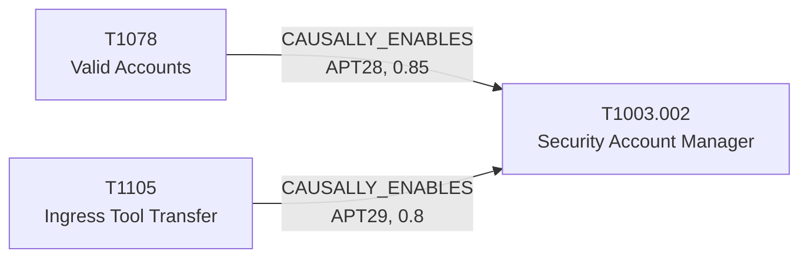

# T1003.002 - OS Credential Dumping: Security Account Manager

## The Attack - What Actually Happens
Two groups, two documented incidents, both ending the same way: local
credential material extracted from the registry. Mandiant's UNC3524
report (merged into APT29 in Nov 2022 as part of "Eye Spy on Your
Email") describes the actor deploying the QUIETEXIT backdoor onto
network appliances, then using it to run `reg save` against the SAM,
SECURITY, and SYSTEM registry hives - offline extraction rather than
in-memory dumping, chosen specifically to avoid touching LSASS. Volexity's
"Nearest Neighbor Attack" documents APT28 doing something near-identical
mechanically (`reg save hklm\sam ...` plus SECURITY and SYSTEM), but
crucially only *after* they'd already pivoted onto the target
organization's own Wi-Fi network using a separate compromised
credential - not as an opening move.

## The Present Problem
SAM dumping via `reg save` is a "living off the land" technique - it's a
built-in Windows command, not a dropped tool, so a naive detection rule
either fires on legitimate backup/admin activity or misses it entirely.
The two incidents modeled here show it landing at different points in an
intrusion (post-tool-deployment for APT29, post-network-pivot for
APT28), which matters for how urgently a defender should respond to a
`reg save hklm\sam` command line depending on what else is already known
about the intrusion.

## How This Graph Models It
- Node: `T1003.002` (Technique), tactic `credential-access`.
- Edges: `T1105 --CAUSALLY_ENABLES--> T1003.002` (APT29, confidence 0.8,
  sample_size 1) and `T1078 --CAUSALLY_ENABLES--> T1003.002` (APT28,
  confidence 0.85, sample_size 1) - both incoming, both from tool/access
  preconditions rather than the technique itself leading anywhere
  further in this seed set.

## Evidence and Sources
- Mandiant, "UNC3524: Eye Spy on Your Email" (May 2022, merged into
  APT29 Nov 2022): explicit sequence of backdoor deployment enabling
  offline registry hive extraction.
- Volexity, "The Nearest Neighbor Attack" (Nov 2024): explicit statement
  that "credential dumping occurred after successful Wi-Fi network
  access was established, not before."
- Modeling note: this is the clearest case in the current edge set of a
  technique being reused twice with different meaning in one incident -
  the Nearest Neighbor intrusion uses Valid Accounts (T1078) both to get
  the initial RDP foothold and, separately, to get onto the target's
  Wi-Fi before this credential-dumping step. The graph models T1078 as
  one node with two outgoing edges rather than inventing separate
  "T1078-instance" nodes, which is a real simplification worth being
  explicit about rather than silently accepting.

## What This Enables
"`reg save hklm\sam` observed on a host attributed to APT28 - is this
early or late in the intrusion?" resolves to "late - this group's
documented pattern has credential dumping following Wi-Fi/network pivot
access, not preceding it," changing the response from "isolate and
investigate initial access" to "assume the actor already has a foothold
and is escalating."

## Flow

<!-- BEGIN GENERATED: graph/generate_diagrams.py (do not hand-edit; rerun the script) -->

<!-- END GENERATED -->
