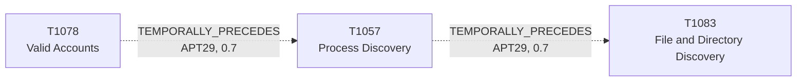

# T1057 - Process Discovery

## The Attack - What Actually Happens
In the SolarWinds/SUNBURST intrusion, APT29 ran process discovery as
part of a broader environmental survey once they already held privileged
access - four independent reports on the intrusion (Microsoft's
Solorigate deep dive, Volexity, UK NCSC's April 2021 advisory, Mandiant's
UNC2452/APT29 writeup, and CrowdStrike's StellarParticle report) all
attribute T1057 to the group alongside the same intrusion's other
discovery and lateral-movement activity. This isn't a standalone
snapshot - it's the same set of sources that documents APT29's Domain
Admin-within-12-hours timeline and its subsequent file/directory
discovery (T1083), placing process discovery squarely inside the
post-compromise survey phase of that operation.

## The Present Problem
`tasklist`, `Get-Process`, `wmic process list` - these commands run
constantly on any Windows fleet for entirely benign reasons, so process
discovery is close to undetectable as a standalone signal. What a flat
technique catalog can't tell a defender is where in an attack chain a
confirmed instance of it sits for a given actor - whether it's early
reconnaissance from an unprivileged foothold, or (as APT29's SolarWinds
pattern shows) a survey step that only happens once the attacker already
has Domain Admin.

## How This Graph Models It
- Node: `T1057` (Technique), tactic `discovery`.
- Edges (both `group_context: APT29`): `T1078 --TEMPORALLY_PRECEDES-->
  T1057` (in, confidence 0.7, sample_size 3) and `T1057
  --TEMPORALLY_PRECEDES--> T1083` (out, confidence 0.7, sample_size 4).

## Evidence and Sources
- UK NSCS Russia SolarWinds April 2021, Mandiant UNC2452 APT29 April
  2022, NSA Joint Advisory SVR SolarWinds April 2021 (T1078 -> T1057,
  three sources co-citing both techniques for the SolarWinds intrusion).
- Volexity SolarWinds, UK NSCS Russia SolarWinds April 2021, NSA Joint
  Advisory SVR SolarWinds April 2021, Mandiant UNC2452 APT29 April 2022
  (T1057 -> T1083, four co-citing sources).
- Both edges are ordering inferences from co-citation and the natural
  shape of a post-compromise survey (privileged access, then process
  survey, then filesystem survey), not from an explicit narrated
  "first X then Y" quote in any single source - hence 0.7 confidence
  rather than the 0.85 on the more directly-quoted T1059.001 -> T1078
  edge this chain extends.

## What This Enables
"Process discovery confirmed for a suspected APT29/SolarWinds-pattern
intrusion, Domain Admin already suspected compromised - what's next?"
resolves to file/directory discovery as the documented next step in this
specific, real intrusion's timeline, not a generic "the attacker might
look around" guess.

## Flow

<!-- BEGIN GENERATED: graph/generate_diagrams.py (do not hand-edit; rerun the script) -->

<!-- END GENERATED -->
