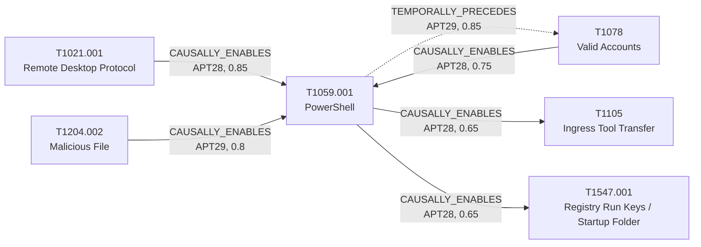

# T1059.001 - PowerShell

## The Attack - What Actually Happens
PowerShell is the workhorse execution technique for all three seed
groups, but it shows up doing different jobs depending on where in an
intrusion it lands. For APT29 in the SolarWinds/SUNBURST intrusion,
Mandiant's UNC2452/APT29 writeup documents PowerShell (alongside Cobalt
Strike loaders) as the execution vector that got the group from an
initial phishing payload to Domain Administrator in under 12 hours. For
APT28 in Volexity's 2024 "Nearest Neighbor Attack," PowerShell shows up
later and narrower: a custom script run *from an already-RDP'd-into
pivot host* to enumerate nearby Wi-Fi networks - reconnaissance, not the
initial foothold. Separately, Trend Micro's Pawn Storm reporting and the
2021 GRU brute-force joint advisory both describe APT28 using PowerShell
as a bridge to further tooling and persistence.

## The Present Problem
"PowerShell was used" is close to a non-signal on its own - it's
present in a huge fraction of intrusions, benign and malicious alike.
The gap isn't detecting PowerShell execution, it's knowing what a given
group's PowerShell usage is *for* and *when in the chain* it happens:
initial-access-adjacent execution (APT29's pattern) looks and should be
triaged completely differently from mid-intrusion reconnaissance running
off an already-compromised pivot host (APT28's Nearest Neighbor
pattern).

## How This Graph Models It
- Node: `T1059.001` (Technique), tactic `execution`.
- Edges (group-scoped, deliberately different per group and per source
  report):
  - APT29: `T1204.002 --CAUSALLY_ENABLES--> T1059.001` (in, macro spawns
    the PowerShell backdoor) and `T1059.001 --TEMPORALLY_PRECEDES-->
    T1078` (out, confidence 0.85 - the highest-confidence edge in this
    project, backed by Mandiant's quoted "12 hours" timeline).
  - APT28: `T1021.001 --CAUSALLY_ENABLES--> T1059.001` (in, confidence
    0.85 - RDP foothold enables the Wi-Fi recon script; corrected
    2026-08-13, see T1021.001's case file), `T1078
    --CAUSALLY_ENABLES--> T1059.001` (in, confidence 0.75, GRU brute
    force advisory, re-grounded 2026-08-14), `T1059.001
    --CAUSALLY_ENABLES--> T1547.001` (out,
    confidence 0.65, Pawn Storm report), and `T1059.001
    --CAUSALLY_ENABLES--> T1105` (out, confidence 0.65, Pawn Storm +
    GRU brute force advisory).

## Cross-Group Comparison
The `T1059.001 <-> T1078` pair is the clearest cross-group contrast in
this project (see docs/decisions/006-cross-group-comparison.md):
APT29's SolarWinds intrusion runs `T1059.001 -> T1078` (execution first,
Domain Admin as the outcome), while APT28's GRU brute-force campaign
runs the identical pair in reverse, `T1078 -> T1059.001` (credentials
first, harvested by password spraying, and PowerShell - an Exchange
`ApplicationImpersonation` cmdlet grant - is what those credentials buy).
Same unordered technique pair, opposite direction, different plane
(on-prem AD vs. M365/Exchange identity). Modeled as a `comparisons`
annotation (`cmp-001`, confidence 0.6) on both constituent edges, not a
third edge - see the ADR for why. Re-grounding this comparison's APT28
side also surfaced that the `T1078 -> T1059.001` edge's evidence had
been paraphrasing the wrong sentence of its source advisory; it's now
corrected and its confidence raised 0.65 -> 0.75 (see that edge's
`evidence` field in `graph/semantic_edges.py`).

## Evidence and Sources
- APT29 edges: Mandiant UNC2452 APT29 April 2022, NSA Joint Advisory SVR
  SolarWinds April 2021.
- APT28 edges: Volexity Nearest Neighbor Attack Nov 2024 (direct,
  single-incident mechanism, now correctly ordered); Cybersecurity
  Advisory GRU Brute Force Campaign July 2021 (re-grounded 2026-08-14 -
  see Cross-Group Comparison above); TrendMicro Pawn Storm Dec 2020
  (co-citation-based, not directly quoted for the exact PowerShell-to-
  persistence/tool-transfer mechanism - see the lower 0.65 confidence on
  those two outgoing edges).

## What This Enables
"We see PowerShell execution and suspect APT28 - where in the chain are
we?" The graph can now distinguish three distinct APT28 PowerShell
patterns by which edge fires: recon off an RDP pivot (Nearest Neighbor),
generic post-credential exploitation (GRU brute force advisory), or a
bridge to persistence/further tooling (Pawn Storm) - each with its own
evidence trail rather than one flattened "PowerShell was involved"
answer.

## Flow

<!-- BEGIN GENERATED: graph/generate_diagrams.py (do not hand-edit; rerun the script) -->

<!-- END GENERATED -->
