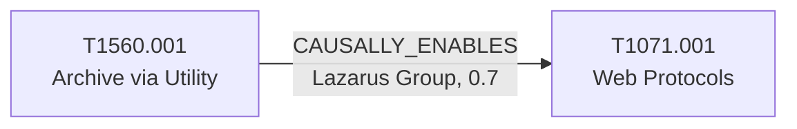

# T1071.001 - Web Protocols

## The Attack - What Actually Happens
CISA AA24-207A documents Lazarus Group's endgame for archived,
collected data: exfiltration over ordinary web protocols to external web
services (cloud storage, or servers unrelated to the group's primary C2
infrastructure), specifically chosen so the traffic blends into normal
HTTPS egress rather than standing out as a dedicated exfil channel. This
is the technique's whole appeal to an adversary - web traffic to cloud
storage endpoints is exactly the kind of traffic most corporate egress
filtering is built to allow, not block.

## The Present Problem
Web-protocol C2/exfil is deliberately built to look like nothing:
generic HTTPS to a cloud storage domain generates no alert on its own.
A defender's only real leverage is *context* - knowing that a specific
actor's collection-and-archive activity culminates in exactly this kind
of traffic, so that a spike in outbound traffic to unfamiliar cloud
storage endpoints, following confirmed Lazarus discovery/archive
activity, gets treated as the last warning it is rather than background
noise.

## How This Graph Models It
- Node: `T1071.001` (Technique), tactic `command-and-control`.
- Edge: `T1560.001 --CAUSALLY_ENABLES--> T1071.001`,
  `group_context: Lazarus Group`, confidence 0.7, sample_size 1.

## Evidence and Sources
- CISA AA24-207A (Aug 2024): archived output is what gets moved out over
  the web-protocol channel to external web services. Sample_size is
  honestly 1 - this specific archive-to-exfiltration linkage comes from
  one advisory; earlier Lazarus reporting (Qualys LolZarus, ESET Lazarus
  Jun 2020, and others already captured in the structural graph's
  USES_TECHNIQUE citations) confirms the group uses T1071.001 generally,
  but doesn't tie it specifically to the archiving step the way AA24-207A
  does.

## What This Enables
"Outbound traffic to an unrecognized cloud storage endpoint, following
confirmed Lazarus archive-utility activity on the same host within the
last few hours - how should this be triaged?" The graph gives a
concrete answer: treat it as likely exfiltration in progress, not a
false positive to defer.

## Flow

<!-- BEGIN GENERATED: graph/generate_diagrams.py (do not hand-edit; rerun the script) -->

<!-- END GENERATED -->
