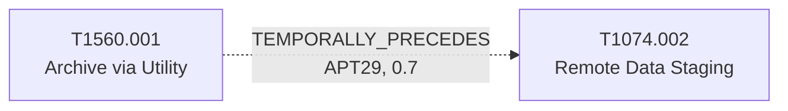

# T1074.002 - Remote Data Staging

## The Attack - What Actually Happens
In the SolarWinds/SUNBURST intrusion, APT29 didn't exfiltrate data
piecemeal from every touched host. Four independent reports on that
intrusion (Microsoft's Solorigate deep dive, Volexity, UK NCSC's April
2021 advisory, and Mandiant's UNC2452/APT29 writeup) co-document data
being archived (T1560.001) and then centralized on a chosen system
within the victim environment before it moved anywhere external - the
staging step ATT&CK calls Remote Data Staging. It's a deliberate
intermediate hop, not a shortcut: consolidating before exfiltration
reduces the number of external connections needed and makes the
eventual transfer look more like routine internal file movement.

## The Present Problem
Data staging activity - large files appearing on an atypical host,
consolidated from multiple sources - is exactly the kind of signal a
defender wants early warning on, since it sits just before the point of
no return (actual exfiltration). But recognizing "this is staging" as
opposed to ordinary file consolidation requires knowing what led into
it. Without that context, staging activity is easy to rationalize away
after the fact rather than escalate in the moment.

## How This Graph Models It
- Node: `T1074.002` (Technique), tactic `collection`.
- Edge: `T1560.001 --TEMPORALLY_PRECEDES--> T1074.002`,
  `group_context: APT29`, confidence 0.7, sample_size 4.

## Evidence and Sources
- Microsoft Deep Dive Solorigate January 2021, Volexity SolarWinds, UK
  NSCS Russia SolarWinds April 2021, Mandiant UNC2452 APT29 April 2022 -
  four independent sources on the same intrusion, co-citing both
  T1560.001 and T1074.002. Confidence is 0.7 rather than higher because
  the ordering (archive, then stage) follows the natural shape of a
  collection pipeline and is confirmed by co-occurrence across sources,
  not an explicit narrated "first X, then Y" quote in any single one of
  them.

## What This Enables
"Consolidated/archived data detected on a host with no ordinary reason
to hold it, APT29 attribution suspected - how urgent is this?" The edge
lets a query surface that, in the one intrusion this pattern is
documented for, staging was the second-to-last step before data left
the network - i.e., treat it as a near-final warning, not routine
housekeeping.

## Flow

<!-- BEGIN GENERATED: graph/generate_diagrams.py (do not hand-edit; rerun the script) -->

<!-- END GENERATED -->
