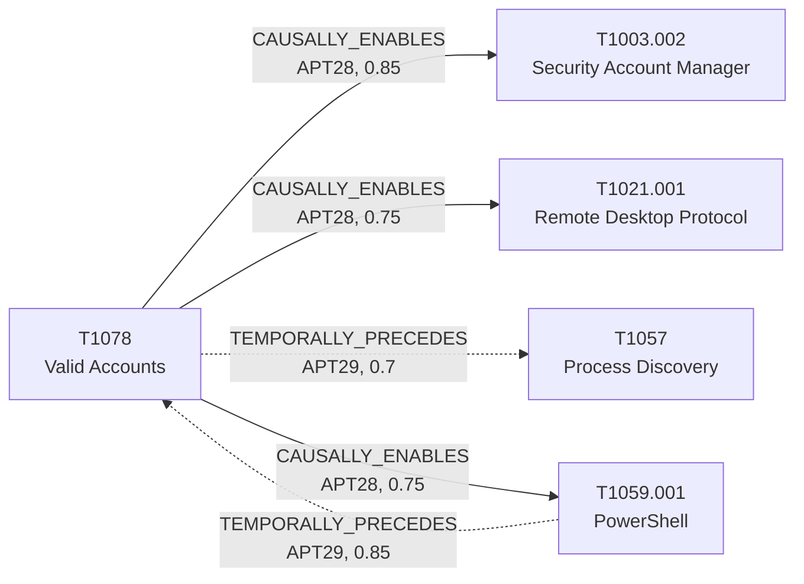

# T1078 - Valid Accounts

## The Attack - What Actually Happens
Once an adversary has credentials - dumped, brute-forced, or phished -
they stop looking like an intruder and start looking like a user. For
APT29 in the SolarWinds intrusion, Mandiant's UNC2452 report documents
this transition happening extremely fast: Domain Administrator privileges
within 12 hours of the initial phishing payload executing, followed by
discovery activity once that access was in hand. For APT28, credentials
do double duty in Volexity's "Nearest Neighbor Attack": one set of
privileged credentials got them RDP access into a pivot host at a
neighboring organization, and a second, separately compromised set later
got them onto the actual target's enterprise Wi-Fi - where they then
dumped SAM/SECURITY/SYSTEM registry hives for more credentials.
Separately, the 2021 NSA/CISA/FBI/NCSC joint advisory on the GRU's
Kubernetes-based brute-force campaign describes credentials obtained at
scale being turned into further access via "remote code execution and
lateral movement."

## The Present Problem
Valid Accounts is arguably the hardest ATT&CK technique to build
detection coverage for precisely because the activity is, by design,
indistinguishable from legitimate use at the log level. A static
technique catalog can't help with that - what helps is knowing what
tends to follow a suspected credential compromise for a given actor, so
monitoring can be front-loaded onto the *next* step rather than the
account activity itself. It also matters that "compromised credentials"
isn't always one event: the Nearest Neighbor incident shows the same
group reusing the technique twice in one intrusion for two different
purposes, which a technique-as-single-node model can only partially
capture (see the note on this in T1003.002's case file).

## How This Graph Models It
- Node: `T1078` (Technique), tactics `initial-access`, `persistence`,
  `privilege-escalation`, `stealth`.
- Edges: `T1059.001 --TEMPORALLY_PRECEDES--> T1078` (APT29, confidence
  0.85, in) and `T1078 --TEMPORALLY_PRECEDES--> T1057` (APT29,
  confidence 0.7, out) on the SolarWinds side; `T1078
  --CAUSALLY_ENABLES--> T1021.001` (APT28, confidence 0.75, out),
  `T1078 --CAUSALLY_ENABLES--> T1059.001` (APT28, confidence 0.75, out),
  and `T1078 --CAUSALLY_ENABLES--> T1003.002` (APT28, confidence 0.85,
  out) on the Nearest Neighbor side.

## Cross-Group Comparison
This technique sits at one end of this project's clearest cross-group
contrast (see docs/decisions/006-cross-group-comparison.md, comparison
`cmp-001`, confidence 0.6): for APT29, valid-account access is the
*outcome* of the SolarWinds intrusion's `T1059.001 -> T1078` chain
(PowerShell/Cobalt Strike execution first, Domain Admin less than 12
hours later). For APT28's GRU brute-force campaign, it's the reverse -
`T1078 -> T1059.001` - credentials obtained by Kubernetes-distributed
password spraying are the *entry ticket* that lets an Exchange
`ApplicationImpersonation` PowerShell cmdlet run at all. Same unordered
pair, opposite direction, opposite role for the credentials (prize vs.
precondition), and a different plane (on-prem AD vs. M365/Exchange
identity). Stored as a `comparisons` annotation on both edges, not a
third edge between the same two nodes - a comparison this direction-
sensitive can't honestly be given a single arrow.

## Evidence and Sources
- Mandiant UNC2452 APT29 April 2022, NSA Joint Advisory SVR SolarWinds
  April 2021, UK NSCS Russia SolarWinds April 2021 (APT29 timeline and
  discovery-phase edges).
- Volexity Nearest Neighbor Attack Nov 2024 (APT28, both credential
  instances - RDP-into-pivot and Wi-Fi-into-target).
- Cybersecurity Advisory GRU Brute Force Campaign July 2021 (APT28,
  credential-to-PowerShell pattern - re-grounded 2026-08-14 on the
  advisory's actual `ApplicationImpersonation` cmdlet-grant fact rather
  than its RCE sentence, which is Exchange CVE exploitation, not
  PowerShell; confidence raised 0.65 -> 0.75 accordingly).

## What This Enables
"A compromised account was confirmed for an APT28-attributed intrusion -
what should we watch for?" surfaces three concrete, differently-sourced
possibilities (RDP-based pivoting, further PowerShell-based
exploitation, or SAM credential dumping) instead of a generic "monitor
for lateral movement" answer - and for APT29, the same question resolves
to "expect a fast privilege-escalation-to-discovery pipeline, historically
under 12 hours."

## Flow

<!-- BEGIN GENERATED: graph/generate_diagrams.py (do not hand-edit; rerun the script) -->

<!-- END GENERATED -->
