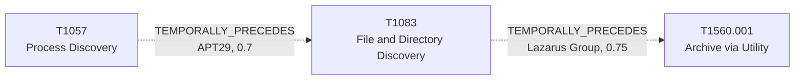

# T1083 - File and Directory Discovery

## The Attack - What Actually Happens
Before an adversary can steal something specific, they have to find it.
For Lazarus Group, CISA advisory AA24-207A (August 2024, on Lazarus'
global espionage campaign supporting North Korea's military and nuclear
programs) documents the group enumerating file systems to locate
"relevant files" ahead of collection - a step that precedes, and is a
precondition for, the archiving step that follows. Earlier vendor
reporting (McAfee, ClearSky, ESET, all 2020) independently documents the
same discovery-then-archive pattern across separate Lazarus campaigns,
which is what makes this a repeated behavior rather than a one-off. For
APT29's SolarWinds intrusion, four reports on that same incident co-cite
T1083 alongside T1057 (Process Discovery), consistent with the group
running both discovery techniques as a paired survey step after gaining
privileged access.

## The Present Problem
Discovery techniques generate a huge volume of benign-looking activity
(`dir`, `Get-ChildItem`, file enumeration is routine for admins and
software alike), so on their own they're nearly useless as a detection
trigger. Their value is entirely retrospective or predictive: once
you've confirmed Lazarus-attributed discovery activity, a flat technique
catalog gives no way to say what comes next, or why it matters enough to
escalate.

## How This Graph Models It
- Node: `T1083` (Technique), tactic `discovery`.
- Edges: `T1057 --TEMPORALLY_PRECEDES--> T1083` (APT29, confidence 0.7,
  sample_size 4, in) and `T1083 --TEMPORALLY_PRECEDES--> T1560.001`
  (Archive via Utility, Lazarus Group, confidence 0.75, sample_size 4,
  out).

## Evidence and Sources
- CISA AA24-207A (Aug 2024): archiving "relevant files" into RAR
  presupposes having enumerated them first.
- McAfee Lazarus Jul 2020, ClearSky Lazarus Aug 2020, ESET Lazarus Jun
  2020: three independent vendor reports co-citing both T1083 and
  T1560.001 for Lazarus, corroborating the pattern outside of the CISA
  advisory.
- Volexity SolarWinds, UK NSCS Russia SolarWinds April 2021, NSA Joint
  Advisory SVR SolarWinds April 2021, Mandiant UNC2452 APT29 April 2022:
  four reports on the SolarWinds intrusion co-citing T1057 and T1083 for
  APT29.

## What This Enables
"File/directory discovery confirmed for a suspected Lazarus intrusion -
should this be escalated as a precursor to data staging?" The edge gives
a query layer a concrete, four-source-backed basis for answering yes,
rather than treating discovery as noise. For APT29, "process discovery
just fired - is file/directory discovery likely next?" resolves to yes,
with the SolarWinds intrusion as the documented basis.

## Flow

<!-- BEGIN GENERATED: graph/generate_diagrams.py (do not hand-edit; rerun the script) -->

<!-- END GENERATED -->
