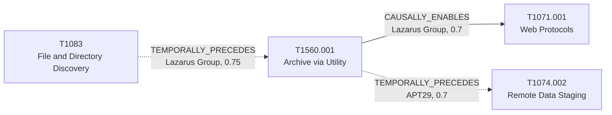

# T1560.001 - Archive via Utility

## The Attack - What Actually Happens
Two groups, two different downstream purposes for the same technique.
CISA AA24-207A documents Lazarus Group compressing files of interest
into RAR archives - in some cases using a copy of WinRAR the actors
brought into the environment themselves alongside other tooling - as
direct preparation for exfiltration to external web services. For
APT29's SolarWinds intrusion, four independent reports (Microsoft's
Solorigate deep dive, Volexity, UK NCSC, Mandiant's UNC2452 writeup)
co-document archiving as a step feeding into T1074.002 (Remote Data
Staging) rather than directly into exfiltration - an intermediate
packaging step before data gets centralized for movement, not the last
step before it leaves the network.

## The Present Problem
"Archive utility invoked" (e.g. an unexpected `rar.exe` or `tar`
invocation) is a strong signal, but what it predicts differs by actor:
for Lazarus it's a near-immediate precursor to exfiltration over web
protocols; for APT29's SolarWinds operators it fed an intermediate
staging step first. A flat technique list can't distinguish "act now,
exfil is imminent" from "there's likely another internal hop before data
leaves."

## How This Graph Models It
- Node: `T1560.001` (Technique), tactic `collection`.
- Edges: `T1083 --TEMPORALLY_PRECEDES--> T1560.001` (Lazarus, in) and
  `T1560.001 --CAUSALLY_ENABLES--> T1071.001` (Lazarus, out, confidence
  0.7, sample_size 1); separately, `T1560.001 --TEMPORALLY_PRECEDES-->
  T1074.002` (APT29, confidence 0.7, sample_size 4) - the same source
  technique, two differently-evidenced group-specific downstream paths.

## Evidence and Sources
- Lazarus: CISA AA24-207A (Aug 2024) - "typically exfiltrate[s] data to
  web services such as cloud storage or servers not associated with
  their primary C2" after archiving.
- APT29: Microsoft Deep Dive Solorigate January 2021, Volexity
  SolarWinds, UK NSCS Russia SolarWinds April 2021, Mandiant UNC2452
  APT29 April 2022 - four sources co-citing both T1560.001 and
  T1074.002 on the same SolarWinds intrusion.

## What This Enables
"Archive utility activity confirmed - which actor, and how urgent is
exfil?" resolves differently depending on attribution: Lazarus
attribution points toward imminent web-protocol exfiltration (single
strong CISA source); APT29/SolarWinds-pattern attribution points toward
an intermediate staging step first (four co-citing sources, slightly
lower per-edge confidence since ordering is inferred from the pipeline
shape rather than an explicit blow-by-blow narration).

## Flow

<!-- BEGIN GENERATED: graph/generate_diagrams.py (do not hand-edit; rerun the script) -->

<!-- END GENERATED -->
