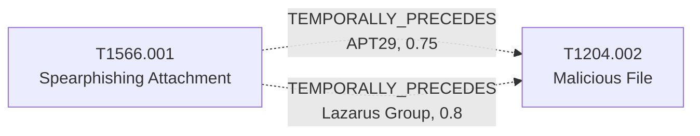

# T1566.001 - Spearphishing Attachment

## The Attack - What Actually Happens
The adversary emails a target a weaponized file - a Word or Excel
document with a malicious macro, a PDF, or a ZIP - crafted to look
relevant to the recipient (a job posting, a policy update, a
diplomatic cable). Nothing happens until the recipient opens the
attachment; the email itself is just delivery. For APT29, this is a
long-running pattern rather than a one-off tactic: F-Secure's "The
Dukes" report, Secureworks' IRON HEMLOCK profile, and ESET's T3 2021
threat report each independently document APT29 phishing campaigns
built around a weaponized Office attachment as the entry point, spanning
from the mid-2010s Dukes malware family through the 2021 campaigns ESET
tracked.

## The Present Problem
A SIEM rule or mail gateway can flag "attachment with macros" or match
a known-bad hash, but that's a point-in-time detection, not a sequence
one. It doesn't tell a defender what a successful open typically leads
to next for a given actor, or how much of the kill chain is already
implied the moment a user reports "I think I opened something." ATT&CK
Navigator lets you look up that APT29 uses T1566.001, but not that for
this group, opening the attachment is reliably followed by a
PowerShell-launching macro rather than, say, an embedded exploit.

## How This Graph Models It
- Node: `T1566.001` (Technique), tactic `initial-access`.
- Edges: `T1566.001 --TEMPORALLY_PRECEDES--> T1204.002` (Malicious File),
  authored twice - `group_context: APT29` (confidence 0.75, sample_size
  3) and `group_context: Lazarus Group` (confidence 0.8, sample_size 2,
  added 2026-08-14). See `graph/semantic_edges.py` for the full evidence
  fields.

## Cross-Group Comparison
Same pair, same direction, materially different mechanism (see
docs/decisions/006-cross-group-comparison.md, comparison `cmp-002`,
confidence 0.7): APT29's weaponized attachment is self-contained - the
macro is inside the file, so execution is a purely local event. Lazarus's
attachment (McAfee's Operation North Star reporting) carries no macro at
all; opening it makes Office fetch a remote `.dotm` template disguised
with a `.jpg` extension, and only then does a macro exist to execute -
T1204.002 is network-dependent for Lazarus, not for APT29. A detonated
copy of the Lazarus attachment with no outbound reachability would show
nothing, which is a real detection-evasion consequence a technique-only
view can't surface. Modeled as a `comparisons` annotation on both edges.

## Evidence and Sources
- Structural USES_TECHNIQUE citations (from the official MITRE STIX
  bundle, via `graph/build_graph.py`): Secureworks IRON HEMLOCK Profile,
  MSTIC NOBELIUM May 2021, ESET T3 Threat Report 2021, F-Secure The
  Dukes.
- The APT29 TEMPORALLY_PRECEDES edge to T1204.002 uses the three sources
  co-cited across both techniques for APT29 (IRON HEMLOCK Profile, ESET
  T3 2021, The Dukes) - all three describe delivery and execution as one
  continuous chain, not two independently observed behaviors.
- The Lazarus Group edge (added 2026-08-14) is sourced to McAfee's
  Operation North Star reporting (Jul 2020, Nov 2020), which narrates the
  same delivery-to-execution step directly. ClearSky Lazarus Aug 2020
  corroborates the wider Dream Job campaign but is deliberately not
  counted in this edge's sources - its documented delivery is largely
  LinkedIn messaging plus cloud-storage links, closer to
  T1566.002/T1566.003 than to Spearphishing Attachment specifically.

## What This Enables
A query like "APT29 phishing email confirmed opened by a user - what
happens next and how confident should we be" can traverse straight to
T1204.002 with the edge's evidence attached, instead of a defender
having to separately recall that this group's phishing payloads are
typically macro-driven. For Lazarus, the same question surfaces a
different, actionable fact: check outbound Office template-fetch
telemetry, not just the attachment itself, since the malicious code may
not exist locally until the document is opened online.

## Flow

<!-- BEGIN GENERATED: graph/generate_diagrams.py (do not hand-edit; rerun the script) -->

<!-- END GENERATED -->
