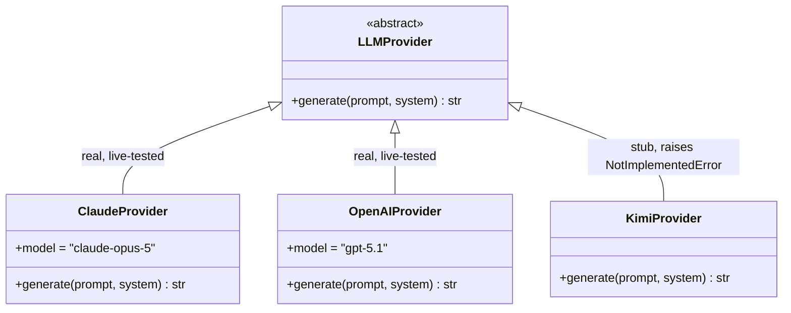

# 004. LLM provider abstraction, one implementation wired up

## Status
Accepted

## Context
`query/rag.py` originally called the `anthropic` SDK directly - correct
for this project's Model Usage convention (see CLAUDE.md), but it meant
the query layer's answer-formatting step was structurally tied to one
vendor's SDK shape (Anthropic's `messages.create`, its own thinking/
refusal handling) inside the module that's supposed to be "graph
traversal, then formatting," not "graph traversal, then Anthropic."

This is worth flagging against the project's own Code Review Standards,
which say not to add complexity ahead of an observed need. Adding a
provider abstraction with only one real implementation is exactly that
kind of preemptive complexity in general - the exception here is that
the requirement came directly from the project owner, who wants a
five-minute path to trying a different vendor later, not from a
speculative "might need this someday" on my part. The design below is
sized to that ask specifically: one interface, one real implementation,
two honest stubs - not a plugin system, not a config-file-driven
provider registry beyond a plain dict.

## Decision

**`query/llm_provider.py` defines `LLMProvider`, an ABC with exactly one
abstract method: `generate(prompt, *, system=None) -> str`.** That's the
entire surface the query layer needs from an LLM - "send this prompt
(with an optional system instruction), get text back." Model choice,
reasoning/thinking configuration, retries, and auth are each provider
implementation's own problem; `rag.py` never sees any of it.

**`ClaudeProvider` is the one working implementation**, wrapping the
`anthropic` SDK per the claude-api skill's conventions (model default
`claude-opus-5`, adaptive thinking, refusal handling) - this is what
`get_provider()` resolves to by default and what every session so far
has actually exercised.

**`OpenAIProvider` and `KimiProvider` are stub classes, not comments or
TODOs.** They implement `LLMProvider` (so `PROVIDERS` and `get_provider`
are already complete and importable) but `generate()` raises
`NotImplementedError` with a message naming exactly what's missing (an
API key) and where to implement it (CLAUDE.md's "Adding an LLM
Provider" section) - not a bare `pass` or a silently-wrong fallback to
Claude.

**`get_provider(name=None)` resolves by name via the `LLM_PROVIDER` env
var** (default `"claude"`), giving a config-entry-not-code-change path to
switching providers once a second one is actually implemented.

## Provider abstraction

Hand-authored - depicts interface/class structure, not graph data, so
it isn't touched by `graph/generate_diagrams.py` (see `.claude/skills/
generate-diagrams/` for that distinction). Update by hand as providers
move from stub to real, or when a new one is added.

## Alternatives considered
- **Leave `rag.py` calling `anthropic` directly**: rejected - not because
  it was wrong (it wasn't; this project's LLM usage genuinely is
  Claude-only right now), but because the project owner explicitly
  wants the vendor swap to be cheap later, and retrofitting an interface
  onto working code is more disruptive than designing the boundary in
  before a second caller exists.
- **A heavier plugin/registry system** (entry points, dynamic imports,
  config schema validation): rejected - `PROVIDERS` is a four-line dict;
  anything more is solving a problem ("many providers, dynamically
  discovered") this project doesn't have and wasn't asked for.
- **Fully implementing OpenAIProvider/KimiProvider now** against a
  best-guess API shape: rejected - no API keys are configured for either
  yet, so there's no way to test them, and shipping untested,
  unverifiable provider code would be exactly the kind of "plausible but
  wrong" mistake this project's Model Usage section already flags as
  the failure mode worth extra care to avoid (see CLAUDE.md, and the
  reversed-edge incident in BUILD_LOG.md).

## Consequences
- Adding a real second provider is genuinely scoped to: implement
  `LLMProvider.generate()` for that vendor's SDK, done - `rag.py` and
  `ask.py` need zero changes.
- The remaining stub is honest about its state: importing and
  instantiating `KimiProvider` works (so code that enumerates
  `PROVIDERS` doesn't break), but any actual `generate()` call fails
  loudly and immediately, with a message pointing at exactly what
  unblocks it.
- This is more structure than the current one-vendor reality strictly
  needs, by design and by explicit request - worth remembering if this
  project's scope discipline is ever being re-audited, so it doesn't get
  incorrectly flagged as accidental complexity.

## Update, 2026-08-13 - OpenAIProvider implemented
`OpenAIProvider` moved from stub to real implementation once an
`OPENAI_API_KEY` was available to test against - no new decision here,
just the "Alternatives considered" caveat above (don't implement against
an unverifiable, untested API shape) no longer applying once a key
existed. Notable in how it was implemented, not just that it was:
- The installed `openai` SDK (v3.0.0) is well past this project's
  training-data knowledge of that library, so the implementation was
  written by installing the package and reading its actual source
  (`_client.py`, `types/responses/response.py`,
  `types/shared/chat_model.py`) rather than from memory - same "verify,
  don't assume" discipline this project already applies to CTI sourcing.
- Uses the Responses API (`client.responses.create`, `response.output_text`)
  rather than Chat Completions - confirmed as the interface the
  installed SDK's own types are built around, not assumed to still be
  the older shape.
- Model default is `gpt-5.1` - confirmed real against the SDK's own
  `ChatModel` type, but deliberately not the newest-looking entries
  (`gpt-5.6-sol`/`-terra`/`-luna`) since no public documentation was
  found disambiguating what each is for. Guessing among three
  undocumented names would have been exactly the kind of invented-data
  mistake this project's conventions exist to prevent. `OPENAI_MODEL`
  remains the override for whoever verifies that disambiguation later.
- Verified end-to-end against the real API before being called done:
  a direct `OpenAIProvider().generate(...)` call, and a full
  `query.rag.answer(..., provider=get_provider("openai"))` call using
  real T1059.001/APT29 facts - both returned correct, correctly-cited
  answers, not just "didn't raise an exception."
